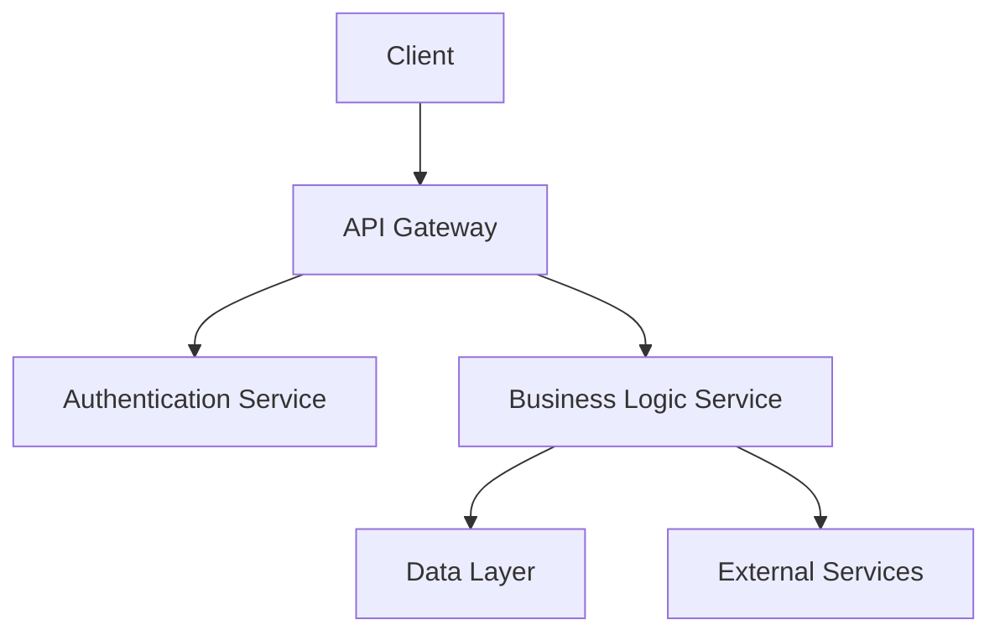

# GitHub Copilot Agentic SDLC Transformation Requirements

## Project Overview

Transform an existing OpenCode agent orchestration system into a GitHub Copilot-based agentic Software Development Life Cycle (SDLC) that leverages GitHub Copilot's native capabilities including Coding Agent, Extensions (MCP), Custom Instructions, Spaces, and advanced prompt engineering optimized for GPT-4.1 and other supported models.

## Core Requirements

### 1. Repository Configuration & Custom Instructions

#### 1.1 Primary Custom Instructions File
**File**: `.github/copilot-instructions.md`

**Requirements**:
- Must implement risk-first development philosophy (core functionality before infrastructure)
- Must enforce TDD seven-phase implementation loop
- Must include zero-tolerance linting policy
- Must enforce semantic versioning standards
- Must define collaborative validation protocol requiring 80% confidence threshold
- Must include context-aware loading strategy for optimal performance
- Must define escalation criteria and error handling protocols

**Content Structure**:
```markdown
# GitHub Copilot Development Standards

## Identity & Core Directives
[Define primary agent behavior, confidence thresholds, validation requirements]

## Development Philosophy
[Risk-first implementation, TDD compliance, quality gates]

## Agent Behavior Guidelines
[Prompt engineering best practices, context provision, validation checkpoints]

## Architecture Standards
[Component classification, validation gates, quality metrics]

## Workflow Templates
[Structured prompts for each development phase]

## Success Criteria & Metrics
[Measurable completion indicators, quality thresholds]
```

**Validation Criteria**:
- File exists in `.github/` directory
- Contains all required sections with specific, actionable guidance
- Includes measurable success criteria for each workflow phase
- Follows GitHub Copilot custom instructions best practices
- Total length optimized for model context windows (8000-12000 tokens)

#### 1.2 Agent-Specific Instruction Files
**Files**: 
- `.github/copilot-instructions/architect.md`
- `.github/copilot-instructions/frontend.md` 
- `.github/copilot-instructions/backend.md`
- `.github/copilot-instructions/devops.md`
- `.github/copilot-instructions/qa.md`
- `.github/copilot-instructions/scribe.md`

**Requirements**:
Each file must contain:
- Domain-specific best practices and patterns
- Detailed prompt templates for common tasks
- Quality validation criteria specific to the domain
- Integration points with other agents
- Success metrics and completion indicators
- Common failure modes and recovery strategies

**Example Content for `frontend.md`**:
```markdown
# Frontend Development Agent Instructions

## Core Responsibilities
- UI/UX component architecture and design
- Responsive design implementation
- Performance optimization
- Accessibility compliance (WCAG 2.1 AA)

## Prompt Templates
### Component Creation
"Create a [component_type] component that:
- Follows atomic design principles
- Implements accessibility best practices
- Uses TypeScript with strict type checking
- Includes comprehensive unit tests
- Follows existing design system patterns"

## Quality Gates
- All components must pass accessibility audits
- Performance metrics within defined thresholds
- Cross-browser compatibility validated
- Design system consistency maintained

## Success Criteria
- Component renders without errors
- Accessibility score >= 95%
- Performance budget not exceeded
- Design review approval obtained
```

**Validation Criteria**:
- All agent instruction files exist with complete content
- Each file contains domain-specific guidance and templates
- Prompt templates are concrete and actionable
- Success criteria are measurable and specific
- Integration points with other agents are clearly defined

### 2. Issue Templates & Workflow Definitions

#### 2.1 Workflow Issue Templates
**Files**:
- `.github/ISSUE_TEMPLATE/outer_loop_strategy.yml`
- `.github/ISSUE_TEMPLATE/research_feature.yml`
- `.github/ISSUE_TEMPLATE/plan_feature.yml`
- `.github/ISSUE_TEMPLATE/implement_task.yml`

**Requirements**:
Each template must:
- Include structured fields for requirements gathering
- Provide clear success criteria and acceptance criteria
- Include validation checkpoints and quality gates
- Define escalation paths and failure recovery
- Integrate with GitHub Copilot Coding Agent workflow
- Include specific prompt guidance for optimal AI interaction

**Example Template for `implement_task.yml`**:
```yaml
name: Implementation Task
description: Implement a specific feature or component with TDD approach
title: "[IMPLEMENT] "
labels: ["implementation", "needs-planning"]
body:
  - type: markdown
    attributes:
      value: |
        ## Implementation Task Guidelines
        This template creates an issue optimized for GitHub Copilot Coding Agent assignment.
        
  - type: input
    id: feature_name
    attributes:
      label: Feature Name
      description: Concise, descriptive name for the feature
      placeholder: "User Authentication Service"
    validations:
      required: true
      
  - type: textarea
    id: requirements
    attributes:
      label: Requirements
      description: Detailed functional and non-functional requirements
      placeholder: |
        FUNCTIONAL REQUIREMENTS:
        - User can authenticate with email/password
        - JWT tokens issued on successful authentication
        - Token refresh mechanism implemented
        
        NON-FUNCTIONAL REQUIREMENTS:
        - Response time < 200ms for authentication
        - 99.9% availability
        - OWASP security compliance
    validations:
      required: true
      
  - type: textarea
    id: acceptance_criteria
    attributes:
      label: Acceptance Criteria
      description: Specific, testable criteria for completion
      placeholder: |
        GIVEN a user with valid credentials
        WHEN they submit authentication request
        THEN they receive valid JWT token
        AND token expires in 1 hour
        AND refresh token is provided
    validations:
      required: true
      
  - type: checkboxes
    id: quality_gates
    attributes:
      label: Quality Gates
      description: Required validation checkpoints
      options:
        - label: TDD implementation with 7-phase loop compliance
        - label: 100% test coverage for core functionality
        - label: Linting validation with zero errors
        - label: Security audit completion
        - label: Performance benchmarks met
        - label: Documentation updated
        
  - type: textarea
    id: implementation_notes
    attributes:
      label: Implementation Notes
      description: Technical constraints, patterns, and guidance
      placeholder: |
        ARCHITECTURE:
        - Use existing authentication middleware pattern
        - Integrate with current JWT service
        - Follow established error handling patterns
        
        CONSTRAINTS:
        - Must be backward compatible
        - No breaking changes to existing API
        - Performance impact < 5% baseline
        
  - type: textarea
    id: copilot_prompt
    attributes:
      label: Copilot Assignment Prompt
      description: Optimized prompt for GitHub Copilot Coding Agent
      placeholder: |
        @copilot implement the user authentication service described above.
        
        Context:
        - Review existing authentication patterns in /src/auth
        - Use established JWT service at /src/services/jwt
        - Follow TDD approach with comprehensive test coverage
        - Ensure security best practices compliance
        
        Requirements:
        - Implement all functional requirements listed above
        - Meet all acceptance criteria
        - Pass all quality gates
        - Follow established code patterns and conventions
        
        Success Criteria:
        - All tests pass
        - Linting errors resolved
        - Security audit clean
        - Performance benchmarks met
```

**Validation Criteria**:
- All workflow templates exist and follow YAML schema
- Templates include required fields for Copilot optimization
- Acceptance criteria are specific and testable
- Quality gates align with overall SDLC standards
- Copilot prompts are well-structured and actionable

#### 2.2 Pull Request Templates
**File**: `.github/pull_request_template.md`

**Requirements**:
- Must include TDD compliance checklist
- Must validate quality gate completion
- Must include Copilot-specific review criteria
- Must define success metrics and validation steps
- Must include rollback and failure recovery procedures

**Template Structure**:
```markdown
# Pull Request: [Title]

## Implementation Summary
Brief description of changes and approach taken.

## Requirements Traceability
- [ ] Links to related issue(s)
- [ ] All acceptance criteria addressed
- [ ] Non-functional requirements validated

## TDD Compliance Validation
- [ ] Phase 1 (RED): Failing tests written first
- [ ] Phase 2 (VALIDATION): Test failures confirmed for correct reasons
- [ ] Phase 3 (GREEN): Minimal implementation created
- [ ] Phase 4 (TEST EXECUTION): New tests pass consistently
- [ ] Phase 5 (REGRESSION CHECK): Full test suite passes
- [ ] Phase 6 (REFACTOR): Code cleaned while maintaining test passage
- [ ] Phase 7 (ITERATION): Final validation and linting completed

## Quality Gates
- [ ] Linting: Zero errors (warnings justified in comments)
- [ ] Testing: Coverage >= 90% for new code
- [ ] Security: No new vulnerabilities introduced
- [ ] Performance: Benchmarks within acceptable thresholds
- [ ] Documentation: Updated for public APIs and complex logic

## Copilot Implementation Notes
If this PR was created by GitHub Copilot Coding Agent:
- [ ] Human review completed with understanding of all changes
- [ ] Implementation approach aligns with requirements
- [ ] Code quality meets established standards
- [ ] Integration points properly handled

## Validation Steps
1. [ ] Local development environment testing
2. [ ] Integration testing completed
3. [ ] Performance impact assessed
4. [ ] Security review conducted
5. [ ] Documentation review completed

## Success Criteria Met
- [ ] All acceptance criteria satisfied
- [ ] Quality gates passed
- [ ] No breaking changes introduced
- [ ] Backward compatibility maintained
- [ ] Performance impact within tolerance

## Rollback Plan
If issues are discovered post-merge:
1. [Specific rollback steps]
2. [Data migration considerations]
3. [Communication plan]
```

**Validation Criteria**:
- Template enforces comprehensive review process
- TDD compliance specifically validated
- Quality gates align with SDLC standards
- Copilot-specific validation included
- Success criteria are measurable and specific

### 3. MCP Extensions Development

#### 3.1 SDLC Orchestrator Extension
**File**: `mcp-extensions/sdlc-orchestrator/`

**Requirements**:
Must implement Model Context Protocol server with the following capabilities:
- Workflow state management and transition validation
- Quality gate enforcement with automated checking
- Escalation trigger detection and user notification
- Progress tracking and metrics collection
- Integration with GitHub APIs for issue and PR management
- Context-aware prompt enhancement for optimal AI interaction

**Core Interface**:
```typescript
interface SDLCOrchestrator {
  // Workflow Management
  validateWorkflowTransition(from: WorkflowPhase, to: WorkflowPhase): ValidationResult;
  getCurrentWorkflowState(issueId: string): WorkflowState;
  updateWorkflowProgress(issueId: string, progress: ProgressUpdate): void;
  
  // Quality Gate Enforcement  
  checkQualityGates(pullRequestId: string): QualityGateResult[];
  enforceValidationCheckpoint(phase: WorkflowPhase, criteria: ValidationCriteria): boolean;
  generateQualityReport(issueId: string): QualityReport;
  
  // Context Enhancement
  enhancePromptContext(prompt: string, context: RepositoryContext): EnhancedPrompt;
  loadRelevantStandards(domain: AgentDomain): DomainStandards;
  optimizeForModel(prompt: string, modelType: SupportedModel): OptimizedPrompt;
  
  // Escalation Management
  detectEscalationTriggers(validationResults: ValidationResult[]): EscalationTrigger[];
  notifyUser(escalation: EscalationTrigger): NotificationResult;
  suggestRecoveryActions(failure: ValidationFailure): RecoveryAction[];
}

interface WorkflowState {
  currentPhase: WorkflowPhase;
  completedGates: QualityGate[];
  pendingValidations: ValidationRequirement[];
  riskLevel: RiskLevel;
  confidence: number;
}

interface QualityGateResult {
  gate: QualityGate;
  status: 'PASSED' | 'FAILED' | 'WARNING';
  details: string;
  evidence: ValidationEvidence;
  recommendations: string[];
}

enum WorkflowPhase {
  OUTER_LOOP_STRATEGY = 'outer_loop_strategy',
  RESEARCH_FEATURE = 'research_feature', 
  PLAN_FEATURE = 'plan_feature',
  IMPLEMENT_TASK = 'implement_task'
}

enum QualityGate {
  REQUIREMENTS_CLARITY = 'requirements_clarity',
  TDD_COMPLIANCE = 'tdd_compliance',
  LINTING_VALIDATION = 'linting_validation',
  TEST_COVERAGE = 'test_coverage',
  SECURITY_AUDIT = 'security_audit',
  PERFORMANCE_BENCHMARK = 'performance_benchmark'
}
```

**File Structure**:
```
mcp-extensions/sdlc-orchestrator/
├── src/
│   ├── server.ts              # MCP server implementation
│   ├── workflows/
│   │   ├── orchestrator.ts    # Main workflow coordination
│   │   ├── validators.ts      # Quality gate validation logic
│   │   └── escalation.ts      # Escalation detection and handling
│   ├── integrations/
│   │   ├── github.ts          # GitHub API integration
│   │   ├── copilot.ts         # Copilot-specific enhancements
│   │   └── metrics.ts         # Progress and quality metrics
│   └── types/
│       ├── workflows.ts       # Workflow-related type definitions
│       ├── quality.ts         # Quality gate type definitions
│       └── api.ts             # API interface definitions
├── tests/
│   ├── unit/                  # Unit tests for all components
│   ├── integration/           # Integration tests with GitHub
│   └── fixtures/              # Test data and mock responses
├── docs/
│   ├── api.md                 # API documentation
│   ├── workflows.md           # Workflow configuration guide
│   └── deployment.md          # Deployment and configuration
├── package.json
├── tsconfig.json
└── README.md
```

**Success Criteria**:
- MCP server starts and responds to health checks
- All workflow transitions validate according to defined rules
- Quality gates enforce zero-tolerance policies correctly
- Escalation triggers activate at appropriate confidence thresholds
- Integration tests pass with 95% coverage
- Performance overhead < 100ms for validation operations

**Validation Steps**:
1. Install and configure MCP server in development environment
2. Test workflow state transitions through complete SDLC cycle
3. Verify quality gate enforcement blocks invalid transitions
4. Confirm escalation notifications work as expected
5. Validate GitHub API integration functionality
6. Performance test under realistic load conditions

#### 3.2 Standards Enforcement Extension  
**File**: `mcp-extensions/standards-enforcer/`

**Requirements**:
Must implement automated enforcement of all SDLC standards including:
- Real-time linting validation with zero-error tolerance
- TDD compliance checking with seven-phase loop verification
- Semantic versioning validation across all components
- Code quality metrics monitoring and enforcement
- Security audit integration and vulnerability detection
- Performance benchmark validation and regression detection

**Core Interface**:
```typescript
interface StandardsEnforcer {
  // Linting Enforcement
  validateLinting(files: FileChange[]): LintingResult;
  enforceZeroErrors(results: LintingResult): EnforcementAction;
  suggestFixes(violations: LintingViolation[]): FixSuggestion[];
  
  // TDD Compliance
  validateTDDPhase(phase: TDDPhase, evidence: TestEvidence): TDDValidationResult;
  checkSevenPhaseCompletion(implementationId: string): TDDComplianceReport;
  enforceTestFirst(codeChanges: CodeChange[]): TDDEnforcementResult;
  
  // Versioning Standards
  validateSemanticVersion(version: string, changeType: ChangeType): VersionValidationResult;
  suggestVersionBump(changes: ChangeSet): VersionRecommendation;
  enforceVersionConsistency(project: ProjectInfo): VersionConsistencyCheck;
  
  // Quality Metrics
  measureCodeQuality(files: FileChange[]): QualityMetrics;
  enforceQualityThresholds(metrics: QualityMetrics): QualityEnforcementResult;
  trackQualityTrends(projectId: string): QualityTrendReport;
  
  // Security Validation
  runSecurityAudit(changes: CodeChange[]): SecurityAuditResult;
  detectVulnerabilities(dependencies: Dependency[]): VulnerabilityReport;
  enforceSecurityStandards(auditResults: SecurityAuditResult): SecurityEnforcementAction;
}

interface LintingResult {
  status: 'PASS' | 'FAIL';
  errors: LintingViolation[];
  warnings: LintingViolation[];
  fixableCount: number;
  totalViolations: number;
}

interface TDDValidationResult {
  phase: TDDPhase;
  isValid: boolean;
  evidence: TestEvidence;
  missingSteps: TDDStep[];
  recommendations: string[];
}

interface QualityMetrics {
  testCoverage: number;
  codeComplexity: number;
  maintainabilityIndex: number;
  technicalDebt: number;
  duplications: number;
}

enum TDDPhase {
  RED = 'red',
  VALIDATION = 'validation', 
  GREEN = 'green',
  TEST_EXECUTION = 'test_execution',
  REGRESSION_CHECK = 'regression_check',
  REFACTOR = 'refactor',
  ITERATION = 'iteration'
}
```

**File Structure**:
```
mcp-extensions/standards-enforcer/
├── src/
│   ├── server.ts              # MCP server implementation
│   ├── enforcers/
│   │   ├── linting.ts         # Linting validation and enforcement
│   │   ├── tdd.ts             # TDD compliance checking
│   │   ├── versioning.ts      # Semantic versioning validation
│   │   ├── quality.ts         # Code quality metrics
│   │   └── security.ts        # Security audit integration
│   ├── integrations/
│   │   ├── eslint.ts          # ESLint integration
│   │   ├── jest.ts            # Jest testing framework integration
│   │   ├── sonarqube.ts       # SonarQube quality metrics
│   │   └── snyk.ts            # Snyk security scanning
│   └── utils/
│       ├── parsers.ts         # Code parsing utilities
│       ├── reporters.ts       # Report generation
│       └── fixers.ts          # Automated fix suggestions
├── configs/
│   ├── eslint/                # ESLint rule configurations
│   ├── jest/                  # Jest testing configurations  
│   └── quality/               # Quality threshold definitions
├── tests/
├── docs/
├── package.json
└── README.md
```

**Success Criteria**:
- Zero linting errors tolerance enforced across all code changes
- TDD seven-phase compliance validated for all implementations
- Semantic versioning rules enforced consistently
- Quality metrics remain above defined thresholds
- Security vulnerabilities detected and blocked automatically
- Performance impact of enforcement < 50ms per validation

**Validation Steps**:
1. Introduce intentional linting errors and verify blocking
2. Test TDD phase validation with incomplete implementations
3. Validate semantic versioning enforcement with various change types
4. Verify quality metrics calculation accuracy
5. Test security audit integration with known vulnerabilities
6. Performance test enforcement operations under load

#### 3.3 Context Enhancement Extension
**File**: `mcp-extensions/context-enhancer/`

**Requirements**:
Must optimize GitHub Copilot interactions through intelligent context management:
- Dynamic context window optimization for different AI models
- Relevant code and documentation discovery and inclusion
- Prompt template enhancement with domain-specific patterns
- Multi-file context aggregation with intelligent prioritization
- Repository knowledge graph construction and navigation
- Historical context integration from previous implementations

**Core Interface**:
```typescript
interface ContextEnhancer {
  // Context Discovery
  discoverRelevantContext(request: ContextRequest): ContextPackage;
  buildKnowledgeGraph(repository: RepositoryInfo): KnowledgeGraph;
  findRelatedImplementations(pattern: CodePattern): RelatedCode[];
  
  // Prompt Enhancement
  enhancePrompt(prompt: string, context: ContextPackage): EnhancedPrompt;
  optimizeForModel(prompt: EnhancedPrompt, model: AIModel): ModelOptimizedPrompt;
  addDomainExpertise(prompt: EnhancedPrompt, domain: ExpertiseDomain): ExpertPrompt;
  
  // Context Packaging
  packageContext(files: FileInfo[], maxTokens: number): ContextPackage;
  prioritizeContext(candidates: ContextCandidate[]): PrioritizedContext[];
  compressContext(context: ContextPackage, targetSize: number): CompressedContext;
  
  // Knowledge Management
  extractPatterns(codebase: CodebaseInfo): DesignPattern[];
  catalogBestPractices(implementations: Implementation[]): BestPracticesCatalog;
  suggestImprovements(currentImplementation: Implementation): Improvement[];
}

interface ContextPackage {
  primaryFiles: FileContext[];
  relatedFiles: FileContext[];
  documentation: DocumentationContext[];
  patterns: DesignPattern[];
  constraints: Constraint[];
  examples: CodeExample[];
  totalTokens: number;
}

interface EnhancedPrompt {
  originalPrompt: string;
  enhancedPrompt: string;
  contextSummary: string;
  domainGuidance: string;
  qualityRequirements: string;
  successCriteria: string;
  validationSteps: string[];
}

interface KnowledgeGraph {
  nodes: KnowledgeNode[];
  relationships: Relationship[];
  patterns: GraphPattern[];
  metrics: GraphMetrics;
}
```

**File Structure**:
```
mcp-extensions/context-enhancer/
├── src/
│   ├── server.ts              # MCP server implementation
│   ├── discovery/
│   │   ├── analyzer.ts        # Code analysis and pattern detection
│   │   ├── navigator.ts       # Repository navigation and search
│   │   └── indexer.ts         # Knowledge graph construction
│   ├── enhancement/
│   │   ├── prompter.ts        # Prompt enhancement logic
│   │   ├── optimizer.ts       # Model-specific optimization
│   │   └── packager.ts        # Context packaging and compression
│   ├── knowledge/
│   │   ├── patterns.ts        # Design pattern recognition
│   │   ├── practices.ts       # Best practices cataloging
│   │   └── examples.ts        # Code example management
│   └── integrations/
│       ├── github.ts          # GitHub API integration
│       ├── copilot.ts         # Copilot-specific enhancements
│       └── ai-models.ts       # AI model optimization profiles
├── knowledge-base/
│   ├── patterns/              # Design pattern definitions
│   ├── practices/             # Best practices documentation
│   └── examples/              # Code example library
├── tests/
├── docs/
├── package.json
└── README.md
```

**Success Criteria**:
- Context discovery identifies relevant files with 90% accuracy
- Prompt enhancement improves response quality by measurable metrics
- Knowledge graph construction completes within 5 minutes for large repositories
- Context packaging stays within model token limits consistently
- Performance overhead < 200ms for context enhancement operations

**Validation Steps**:
1. Test context discovery with various code patterns and domains
2. Validate prompt enhancement improves AI response quality
3. Verify knowledge graph construction accuracy and completeness
4. Test context packaging with different model token limits
5. Performance test context enhancement under realistic load
6. Validate integration with GitHub Copilot workflows

### 4. Knowledge Base Configuration

#### 4.1 Architecture Documentation Knowledge Base
**Directory**: `knowledge-base/architecture/`

**Requirements**:
Must contain comprehensive architectural guidance accessible to GitHub Copilot:
- System design patterns with concrete implementation examples
- API design standards with OpenAPI specifications and examples
- Data architecture patterns with schema examples and anti-patterns
- Integration patterns with external services and failure handling
- Security architecture with threat models and mitigation strategies
- Performance optimization patterns with benchmarking criteria

**File Structure**:
```
knowledge-base/architecture/
├── system-design/
│   ├── patterns/
│   │   ├── microservices.md            # Microservices design patterns
│   │   ├── event-driven.md             # Event-driven architecture
│   │   ├── layered-architecture.md     # Layered architecture patterns
│   │   └── clean-architecture.md       # Clean architecture implementation
│   ├── examples/
│   │   ├── user-service/               # Complete microservice example
│   │   ├── event-bus/                  # Event bus implementation
│   │   └── api-gateway/                # API gateway configuration
│   └── anti-patterns/
│       ├── monolith-pitfalls.md        # Common monolithic mistakes
│       ├── coupling-issues.md          # Tight coupling problems
│       └── performance-bottlenecks.md  # Performance anti-patterns
├── api-design/
│   ├── standards/
│   │   ├── rest-principles.md          # RESTful API design principles
│   │   ├── graphql-patterns.md         # GraphQL schema design
│   │   ├── versioning-strategy.md      # API versioning approaches
│   │   └── error-handling.md           # Standardized error responses
│   ├── examples/
│   │   ├── user-api.yaml               # OpenAPI user service spec
│   │   ├── order-api.yaml              # OpenAPI order service spec
│   │   └── graphql-schema.graphql      # GraphQL schema example
│   └── validation/
│       ├── request-validation.md       # Input validation patterns
│       ├── response-validation.md      # Output validation patterns
│       └── security-validation.md      # Security validation requirements
├── data-architecture/
│   ├── patterns/
│   │   ├── data-modeling.md            # Entity relationship modeling
│   │   ├── caching-strategies.md       # Caching pattern implementations
│   │   ├── data-migration.md           # Safe migration patterns
│   │   └── backup-recovery.md          # Backup and recovery strategies
│   ├── schemas/
│   │   ├── user-schema.sql             # User data model example
│   │   ├── order-schema.sql            # Order data model example
│   │   └── audit-schema.sql            # Audit logging schema
│   └── optimization/
│       ├── indexing-strategies.md      # Database indexing patterns
│       ├── query-optimization.md       # Query performance optimization
│       └── connection-pooling.md       # Connection management patterns
├── integration/
│   ├── patterns/
│   │   ├── circuit-breaker.md          # Circuit breaker implementation
│   │   ├── retry-patterns.md           # Retry logic and backoff strategies
│   │   ├── bulk-operations.md          # Batch processing patterns
│   │   └── event-sourcing.md           # Event sourcing implementation
│   ├── examples/
│   │   ├── payment-integration/        # Payment service integration
│   │   ├── email-service/              # Email service integration
│   │   └── notification-service/       # Notification system integration
│   └── failure-handling/
│       ├── graceful-degradation.md     # Degraded service patterns
│       ├── fallback-strategies.md      # Fallback implementation
│       └── monitoring-alerts.md        # Failure detection and alerting
├── security/
│   ├── patterns/
│   │   ├── authentication.md           # Authentication implementation
│   │   ├── authorization.md            # Authorization patterns
│   │   ├── encryption.md               # Data encryption standards
│   │   └── audit-logging.md            # Security audit logging
│   ├── threat-models/
│   │   ├── api-threats.md              # API security threat model
│   │   ├── data-threats.md             # Data security threat model
│   │   └── infrastructure-threats.md   # Infrastructure threat model
│   └── compliance/
│       ├── gdpr-compliance.md          # GDPR compliance requirements
│       ├── pci-compliance.md           # PCI DSS compliance
│       └── security-headers.md         # HTTP security headers
└── performance/
    ├── patterns/
    │   ├── caching-strategies.md       # Performance caching patterns
    │   ├── load-balancing.md           # Load balancing configurations
    │   ├── async-processing.md         # Asynchronous processing patterns
    └── benchmarks/
        ├── response-time-targets.md    # Response time requirements
        ├── throughput-requirements.md  # Throughput benchmarks
        └── resource-limits.md          # Resource utilization limits
```

**Content Requirements for Each File**:
- **Concrete Examples**: Working code implementations, not just theoretical descriptions
- **Anti-Patterns**: What NOT to do with specific examples and explanations
- **Validation Criteria**: How to verify correct implementation
- **Performance Metrics**: Specific benchmarks and measurement criteria
- **Security Considerations**: Threat analysis and mitigation strategies
- **Integration Points**: How patterns work together in the overall system

**Example Content Structure for `microservices.md`**:
```markdown
# Microservices Design Patterns

## Overview
Microservices architecture patterns for building scalable, maintainable distributed systems.

## Core Principles
1. **Single Responsibility**: Each service owns one business capability
2. **Autonomous Teams**: Teams can develop, deploy, and scale independently
3. **Decentralized Governance**: Services can use different technologies
4. **Failure Isolation**: Service failures don't cascade system-wide

## Implementation Patterns

### Service Decomposition Pattern
**Use Case**: Breaking monolith into microservices
**Implementation**:
```typescript
// Domain-driven service boundaries
interface UserService {
  createUser(userData: UserCreationData): Promise<User>;
  authenticate(credentials: Credentials): Promise<AuthToken>;
  updateProfile(userId: string, updates: ProfileUpdates): Promise<User>;
}

interface OrderService {
  createOrder(orderData: OrderCreationData): Promise<Order>;
  processPayment(orderId: string, payment: PaymentInfo): Promise<PaymentResult>;
  updateOrderStatus(orderId: string, status: OrderStatus): Promise<Order>;
}
```

**Validation Criteria**:
- [ ] Each service has clear business domain boundary
- [ ] Services can be deployed independently
- [ ] No shared databases between services
- [ ] Inter-service communication through well-defined APIs

### API Gateway Pattern
**Use Case**: Single entry point for client requests
**Implementation**:
```typescript
// API Gateway routing configuration
const gatewayConfig = {
  routes: [
    {
      path: '/api/users/*',
      target: 'user-service:3001',
      methods: ['GET', 'POST', 'PUT', 'DELETE'],
      auth: 'required'
    },
    {
      path: '/api/orders/*', 
      target: 'order-service:3002',
      methods: ['GET', 'POST', 'PUT'],
      auth: 'required',
      rateLimit: { requests: 100, window: '1m' }
    }
  ],
  middleware: [
    'cors',
    'authentication', 
    'rateLimit',
    'logging'
  ]
};
```

**Anti-Patterns**:
❌ **Smart Gateway**: Business logic in gateway
```typescript
// DON'T DO THIS - Business logic in gateway
app.post('/api/orders', async (req, res) => {
  // ❌ Validation logic in gateway
  if (!req.body.items || req.body.items.length === 0) {
    return res.status(400).json({ error: 'Orders must have items' });
  }
  
  // ❌ Business calculations in gateway
  const total = req.body.items.reduce((sum, item) => sum + item.price, 0);
  
  // Forward to service
  const result = await orderService.createOrder({ ...req.body, total });
  res.json(result);
});
```

✅ **Correct Implementation**: Dumb proxy
```typescript
// DO THIS - Simple routing and forwarding
app.post('/api/orders', proxy('order-service:3002'));
```

## Success Criteria
- [ ] Service boundaries align with business domains
- [ ] Services can be scaled independently based on load
- [ ] Service failures are isolated and don't cascade
- [ ] Development teams can work autonomously
- [ ] Deployment frequency increased by 50%
- [ ] System resilience improved with circuit breakers

## Performance Benchmarks
- **Service Response Time**: < 100ms for internal calls
- **Gateway Latency**: < 10ms additional overhead
- **Service Discovery**: < 5ms lookup time
- **Health Check Response**: < 50ms per service

## Monitoring and Observability
```typescript
// Distributed tracing implementation
import { trace, context } from '@opentelemetry/api';

const tracer = trace.getTracer('user-service');

export async function createUser(userData: UserCreationData): Promise<User> {
  const span = tracer.startSpan('user.create');
  
  try {
    span.setAttributes({
      'user.email': userData.email,
      'operation': 'create'
    });
    
    const user = await userRepository.create(userData);
    span.setStatus({ code: trace.SpanStatusCode.OK });
    return user;
  } catch (error) {
    span.recordException(error);
    span.setStatus({ 
      code: trace.SpanStatusCode.ERROR, 
      message: error.message 
    });
    throw error;
  } finally {
    span.end();
  }
}
```

## Common Pitfalls and Solutions
1. **Distributed Monolith**: Services too tightly coupled
   - Solution: Define clear service contracts and minimize dependencies
   
2. **Data Consistency**: Managing transactions across services
   - Solution: Implement saga pattern for distributed transactions
   
3. **Service Discovery**: Finding and connecting to services
   - Solution: Use service mesh or discovery service with health checks

## Integration Examples
See: `/examples/microservices-demo/` for complete implementation
```

**Validation Criteria**:
- All documentation files exist with complete, actionable content
- Examples are working code that can be executed and tested
- Anti-patterns are clearly identified with explanations
- Success criteria are measurable and specific
- Integration points between patterns are documented
- Performance benchmarks are realistic and achievable

#### 4.2 Testing Strategy Knowledge Base
**Directory**: `knowledge-base/testing/`

**Requirements**:
Must provide comprehensive testing guidance for TDD implementation:
- Unit testing patterns with frameworks and best practices
- Integration testing strategies with real-world examples
- End-to-end testing automation with tools and configurations
- Test data management with realistic datasets and privacy considerations
- Performance testing with load testing scenarios and benchmarks
- Security testing with penetration testing guidelines and tools

**File Structure**:
```
knowledge-base/testing/
├── unit-testing/
│   ├── frameworks/
│   │   ├── jest-patterns.md            # Jest testing patterns and configurations
│   │   ├── vitest-setup.md             # Vitest configuration and usage
│   │   ├── mocha-chai.md               # Mocha and Chai testing patterns
│   │   └── testing-library.md          # React Testing Library patterns
│   ├── patterns/
│   │   ├── tdd-seven-phase.md          # Seven-phase TDD implementation
│   │   ├── test-doubles.md             # Mocks, stubs, and fakes
│   │   ├── parameterized-tests.md      # Data-driven testing patterns
│   │   └── test-organization.md        # Test structure and organization
│   ├── examples/
│   │   ├── service-testing/            # Service layer testing examples
│   │   ├── component-testing/          # React component testing
│   │   ├── utility-testing/            # Utility function testing
│   │   └── async-testing/              # Asynchronous code testing
│   └── coverage/
│       ├── coverage-requirements.md    # Coverage thresholds and metrics
│       ├── coverage-tools.md           # Coverage analysis tools
│       └── coverage-reporting.md       # Coverage reporting and CI integration
├── integration-testing/
│   ├── strategies/
│   │   ├── api-integration.md          # API integration testing
│   │   ├── database-testing.md         # Database integration patterns
│   │   ├── external-services.md        # Third-party service testing
│   │   └── contract-testing.md         # Consumer-driven contract testing
│   ├── tools/
│   │   ├── testcontainers.md           # Docker-based integration tests
│   │   ├── wiremock.md                 # Service virtualization
│   │   ├── pact.md                     # Contract testing with Pact
│   │   └── newman.md                   # Postman collection testing
│   ├── examples/
│   │   ├── microservice-integration/   # Microservice integration tests
│   │   ├── api-contract-tests/         # API contract testing examples
│   │   └── database-integration/       # Database integration examples
│   └── environments/
│       ├── test-environment-setup.md   # Test environment configuration
│       ├── data-seeding.md             # Test data preparation
│       └── environment-isolation.md    # Test isolation strategies
├── e2e-testing/
│   ├── frameworks/
│   │   ├── playwright.md               # Playwright automation framework
│   │   ├── cypress.md                  # Cypress testing framework
│   │   ├── selenium.md                 # Selenium WebDriver patterns
│   │   └── puppeteer.md                # Puppeteer automation
│   ├── patterns/
│   │   ├── page-object-model.md        # Page Object Model implementation
│   │   ├── test-data-management.md     # E2E test data strategies
│   │   ├── cross-browser-testing.md    # Multi-browser testing approach
│   │   └── mobile-testing.md           # Mobile application testing
│   ├── examples/
│   │   ├── user-journey-tests/         # Complete user journey examples
│   │   ├── form-testing/               # Form interaction testing
│   │   ├── navigation-testing/         # Navigation and routing tests
│   │   └── responsive-testing/         # Responsive design testing
│   └── ci-integration/
│       ├── github-actions.md           # GitHub Actions E2E integration
│       ├── parallel-execution.md       # Parallel test execution
│       └── test-reporting.md           # E2E test reporting and artifacts
├── performance-testing/
│   ├── strategies/
│   │   ├── load-testing.md             # Load testing methodologies
│   │   ├── stress-testing.md           # Stress testing approaches
│   │   ├── spike-testing.md            # Spike testing patterns
│   │   └── volume-testing.md           # Volume testing strategies
│   ├── tools/
│   │   ├── k6.md                       # k6 performance testing
│   │   ├── jmeter.md                   # Apache JMeter testing
│   │   ├── artillery.md                # Artillery.io load testing
│   │   └── lighthouse.md               # Frontend performance testing
│   ├── examples/
│   │   ├── api-load-tests/             # API load testing scripts
│   │   ├── database-performance/       # Database performance tests
│   │   └── frontend-performance/       # Frontend performance examples
│   └── benchmarks/
│       ├── response-time-targets.md    # Response time benchmarks
│       ├── throughput-requirements.md  # Throughput expectations
│       └── resource-utilization.md     # Resource usage limits
├── security-testing/
│   ├── strategies/
│   │   ├── penetration-testing.md      # Penetration testing approach
│   │   ├── vulnerability-scanning.md   # Automated vulnerability scanning
│   │   ├── authentication-testing.md   # Authentication security testing
│   │   └── authorization-testing.md    # Authorization security testing
│   ├── tools/
│   │   ├── owasp-zap.md               # OWASP ZAP security testing
│   │   ├── burp-suite.md              # Burp Suite professional
│   │   ├── snyk.md                    # Snyk vulnerability scanning
│   │   └── sonarqube.md               # SonarQube security analysis
│   ├── examples/
│   │   ├── sql-injection-tests/        # SQL injection testing
│   │   ├── xss-testing/               # Cross-site scripting tests
│   │   ├── csrf-testing/              # CSRF protection testing
│   │   └── api-security-tests/        # API security testing
│   └── compliance/
│       ├── owasp-top10.md             # OWASP Top 10 testing
│       ├── gdpr-testing.md            # GDPR compliance testing
│       └── security-headers.md        # Security headers validation
└── test-automation/
    ├── ci-cd-integration/
    │   ├── github-actions-testing.md  # GitHub Actions test automation
    │   ├── test-parallelization.md    # Parallel test execution
    │   ├── test-reporting.md          # Test result reporting
    │   └── quality-gates.md           # Quality gate enforcement
    ├── test-data/
    │   ├── data-generation.md         # Test data generation strategies
    │   ├── data-privacy.md            # Privacy-safe test data
    │   ├── data-versioning.md         # Test data version management
    │   └── data-cleanup.md            # Test data cleanup procedures
    └── best-practices/
        ├── test-naming.md             # Test naming conventions
        ├── test-organization.md       # Test suite organization
        ├── test-maintenance.md        # Test maintenance strategies
        └── debugging-tests.md         # Test debugging techniques
```

**Content Requirements for TDD Seven-Phase Implementation**:
```markdown
# TDD Seven-Phase Implementation Guide

## Phase 1: RED - Write Failing Test

### Purpose
Write a test that clearly defines the expected behavior before implementing any code.

### Implementation Steps
1. **Understand Requirements**: Clearly define what the code should do
2. **Design Test Interface**: Define the API/interface the code will expose
3. **Write Minimal Test**: Create the simplest test that validates the requirement
4. **Verify Test Fails**: Ensure the test fails for the right reason

### Example Implementation
```typescript
// Phase 1: RED - Write failing test first
describe('UserService', () => {
  describe('createUser', () => {
    it('should create a new user with valid data', async () => {
      // Arrange
      const userData = {
        email: 'test@example.com',
        password: 'securePassword123',
        firstName: 'John',
        lastName: 'Doe'
      };
      
      const userService = new UserService();
      
      // Act
      const result = await userService.createUser(userData);
      
      // Assert
      expect(result).toBeDefined();
      expect(result.id).toBeDefined();
      expect(result.email).toBe(userData.email);
      expect(result.firstName).toBe(userData.firstName);
      expect(result.lastName).toBe(userData.lastName);
      expect(result.password).toBeUndefined(); // Password should not be returned
      expect(result.createdAt).toBeDefined();
    });
  });
});
```

### Validation Checklist
- [ ] Test is written before any implementation code
- [ ] Test clearly expresses the intended behavior
- [ ] Test will fail because implementation doesn't exist yet
- [ ] Test follows AAA pattern (Arrange, Act, Assert)
- [ ] Test is focused on a single behavior
- [ ] Test name clearly describes the expected behavior

### Common Mistakes to Avoid
❌ **Writing implementation first**
❌ **Testing implementation details instead of behavior**
❌ **Writing multiple assertions for different behaviors**
❌ **Making tests dependent on external systems**

## Phase 2: VALIDATION - Confirm Test Fails Correctly

### Purpose
Verify that the test fails for the expected reason, not due to syntax errors or other issues.

### Implementation Steps
1. **Run Test Suite**: Execute the failing test
2. **Verify Failure Reason**: Confirm failure is due to missing implementation
3. **Check Error Message**: Ensure error message is clear and helpful
4. **Fix Test Issues**: Resolve any syntax or logic errors in the test

### Example Validation
```bash
# Run the specific test
npm test -- --testNamePattern="should create a new user with valid data"

# Expected output:
# FAIL  src/services/UserService.test.ts
# ● UserService › createUser › should create a new user with valid data
#   ReferenceError: UserService is not defined
```

### Validation Checklist
- [ ] Test fails due to missing implementation, not test errors
- [ ] Error message clearly indicates what's missing
- [ ] Test compiles and runs without syntax errors
- [ ] Failure is repeatable and consistent

## Phase 3: GREEN - Write Minimal Implementation

### Purpose
Write the simplest code that makes the test pass, without over-engineering.

### Implementation Steps
1. **Create Minimal Structure**: Define classes/functions to satisfy test
2. **Implement Core Logic**: Add just enough logic to pass the test
3. **Avoid Over-Engineering**: Don't add features not tested
4. **Focus on Test Requirements**: Satisfy only what the test demands

### Example Implementation
```typescript
// Phase 3: GREEN - Minimal implementation to pass test
interface User {
  id: string;
  email: string;
  firstName: string;
  lastName: string;
  createdAt: Date;
}

interface UserCreationData {
  email: string;
  password: string;
  firstName: string;
  lastName: string;
}

export class UserService {
  async createUser(userData: UserCreationData): Promise<User> {
    // Minimal implementation - just enough to pass the test
    return {
      id: crypto.randomUUID(),
      email: userData.email,
      firstName: userData.firstName,
      lastName: userData.lastName,
      createdAt: new Date()
    };
  }
}
```

### Validation Checklist
- [ ] Implementation makes the test pass
- [ ] Code is minimal and focused
- [ ] No unnecessary features added
- [ ] Implementation satisfies test requirements exactly

## Phase 4: TEST EXECUTION - Verify Test Passes

### Purpose
Confirm that the new test passes consistently and reliably.

### Implementation Steps
1. **Run Individual Test**: Execute the specific test multiple times
2. **Verify Consistent Results**: Ensure test passes reliably
3. **Check Test Isolation**: Ensure test doesn't depend on external state
4. **Validate Assertions**: Confirm all assertions are meaningful

### Example Execution
```bash
# Run test multiple times to ensure consistency
for i in {1..5}; do
  npm test -- --testNamePattern="should create a new user with valid data"
done

# All runs should pass consistently
```

### Validation Checklist
- [ ] Test passes consistently across multiple runs
- [ ] Test doesn't depend on external state or timing
- [ ] All assertions are validated and meaningful
- [ ] Test execution time is reasonable (< 100ms for unit tests)

## Phase 5: REGRESSION CHECK - Run Full Test Suite

### Purpose
Ensure new implementation doesn't break existing functionality.

### Implementation Steps
1. **Run Complete Test Suite**: Execute all existing tests
2. **Verify No Regressions**: Confirm all tests still pass
3. **Check Coverage Impact**: Ensure coverage doesn't decrease
4. **Review Integration Points**: Verify related functionality works

### Example Execution
```bash
# Run full test suite with coverage
npm test -- --coverage

# Check for any failing tests
npm test -- --passWithNoTests=false

# Verify coverage thresholds
npm run test:coverage-check
```

### Validation Checklist
- [ ] All existing tests continue to pass
- [ ] Code coverage meets or exceeds thresholds
- [ ] No unintended side effects on related functionality
- [ ] Performance impact is acceptable

## Phase 6: REFACTOR - Clean Up Code

### Purpose
Improve code quality while maintaining test passage.

### Implementation Steps
1. **Identify Improvement Opportunities**: Look for code smells
2. **Apply Refactoring Patterns**: Use established refactoring techniques
3. **Maintain Test Passage**: Ensure tests continue to pass
4. **Improve Readability**: Make code more maintainable

### Example Refactoring
```typescript
// Before refactoring - basic implementation
export class UserService {
  async createUser(userData: UserCreationData): Promise<User> {
    return {
      id: crypto.randomUUID(),
      email: userData.email,
      firstName: userData.firstName,
      lastName: userData.lastName,
      createdAt: new Date()
    };
  }
}

// After refactoring - improved with validation and error handling
export class UserService {
  private validateUserData(userData: UserCreationData): void {
    if (!userData.email || !this.isValidEmail(userData.email)) {
      throw new Error('Valid email is required');
    }
    if (!userData.firstName || userData.firstName.trim().length === 0) {
      throw new Error('First name is required');
    }
    if (!userData.lastName || userData.lastName.trim().length === 0) {
      throw new Error('Last name is required');
    }
  }

  private isValidEmail(email: string): boolean {
    const emailRegex = /^[^\s@]+@[^\s@]+\.[^\s@]+$/;
    return emailRegex.test(email);
  }

  async createUser(userData: UserCreationData): Promise<User> {
    this.validateUserData(userData);
    
    return {
      id: crypto.randomUUID(),
      email: userData.email.toLowerCase().trim(),
      firstName: userData.firstName.trim(),
      lastName: userData.lastName.trim(),
      createdAt: new Date()
    };
  }
}
```

### Validation Checklist
- [ ] All tests continue to pass after refactoring
- [ ] Code readability and maintainability improved
- [ ] No new functionality added without tests
- [ ] Code follows established patterns and conventions

## Phase 7: ITERATION - Assess and Continue

### Purpose
Evaluate completion and determine next steps.

### Implementation Steps
1. **Review Requirements**: Check if all requirements are satisfied
2. **Assess Test Coverage**: Ensure adequate coverage for the feature
3. **Identify Next Tests**: Determine what tests to write next
4. **Plan Next Iteration**: Return to Phase 1 for next requirement

### Example Assessment
```typescript
// Assessment checklist for UserService.createUser
// ✅ Happy path test written and passing
// ✅ Basic validation implemented
// ❌ Error cases not tested yet
// ❌ Duplicate email handling not implemented
// ❌ Password hashing not implemented

// Next iteration tests to write:
describe('UserService', () => {
  describe('createUser', () => {
    it('should throw error when email is invalid', async () => {
      // Next test to implement
    });
    
    it('should throw error when email already exists', async () => {
      // Next test to implement  
    });
    
    it('should hash password before storing', async () => {
      // Next test to implement
    });
  });
});
```

### Validation Checklist
- [ ] Current requirement fully implemented and tested
- [ ] Code quality meets standards
- [ ] Next iteration requirements identified
- [ ] Progress documented and communicated

## Success Metrics for Seven-Phase TDD

### Compliance Tracking
- **Phase Completion Rate**: 100% of phases completed for each feature
- **Test-First Adherence**: 100% of implementation preceded by failing tests
- **Regression Prevention**: 0 regressions introduced during development
- **Code Quality**: Maintainability index > 80

### Quality Indicators
- **Test Coverage**: > 90% line coverage, > 85% branch coverage
- **Test Execution Time**: < 10 seconds for full unit test suite
- **Defect Density**: < 1 defect per 100 lines of code
- **Refactoring Safety**: 100% of refactoring operations maintain test passage

### Process Metrics
- **Development Velocity**: 25% faster delivery with TDD
- **Debugging Time**: 50% reduction in debugging time
- **Maintenance Cost**: 30% reduction in maintenance effort
- **Developer Confidence**: 95% confidence in code changes
```

**Validation Criteria**:
- All testing documentation provides concrete, executable examples
- TDD seven-phase process is detailed with specific validation steps
- Testing tools are configured with working examples
- Coverage requirements are specific and measurable
- Integration with CI/CD pipelines is documented and tested

### 5. Spaces Configuration

#### 5.1 Development Workflow Spaces
**Requirements**:
Must create collaborative spaces for each major workflow phase:
- Strategic Planning Space for outer loop strategy discussions
- Feature Research Space for investigation and analysis
- Implementation Planning Space for technical design
- Code Review Space for quality validation and feedback

**Space Configuration Structure**:
```
copilot-spaces/
├── strategic-planning/
│   ├── space-config.json
│   ├── templates/
│   │   ├── product-strategy-template.md
│   │   ├── feature-prioritization-template.md
│   │   └── technical-roadmap-template.md
│   ├── knowledge-sources/
│   │   ├── market-research/
│   │   ├── user-feedback/
│   │   └── competitive-analysis/
│   └── collaboration-guidelines.md
├── feature-research/
│   ├── space-config.json
│   ├── templates/
│   │   ├── research-plan-template.md
│   │   ├── technical-investigation-template.md
│   │   └── feasibility-analysis-template.md
│   ├── knowledge-sources/
│   │   ├── technical-documentation/
│   │   ├── api-references/
│   │   └── integration-guides/
│   └── research-methodologies.md
├── implementation-planning/
│   ├── space-config.json
│   ├── templates/
│   │   ├── technical-design-template.md
│   │   ├── architecture-decision-template.md
│   │   └── implementation-plan-template.md
│   ├── knowledge-sources/
│   │   ├── design-patterns/
│   │   ├── coding-standards/
│   │   └── best-practices/
│   └── planning-guidelines.md
└── code-review/
    ├── space-config.json
    ├── templates/
    │   ├── review-checklist-template.md
    │   ├── quality-assessment-template.md
    │   └── feedback-template.md
    ├── knowledge-sources/
    │   ├── quality-standards/
    │   ├── security-guidelines/
    │   └── performance-benchmarks/
    └── review-standards.md
```

**Example Space Configuration for Implementation Planning**:
```json
{
  "name": "Implementation Planning",
  "description": "Collaborative space for technical design and implementation planning",
  "type": "team",
  "settings": {
    "visibility": "team",
    "permissions": {
      "read": ["team_members", "stakeholders"],
      "write": ["developers", "architects", "tech_leads"],
      "admin": ["tech_leads", "engineering_managers"]
    },
    "integrations": {
      "github": {
        "repository": "current",
        "branches": ["main", "develop"],
        "paths": ["/src", "/tests", "/docs"]
      },
      "knowledge_bases": [
        "architecture-patterns",
        "coding-standards", 
        "api-guidelines"
      ]
    },
    "ai_settings": {
      "model_preference": "gpt-4.1",
      "context_enhancement": true,
      "quality_enforcement": true,
      "standards_compliance": true
    }
  },
  "workflows": [
    {
      "name": "Technical Design Review",
      "trigger": "design_document_created",
      "steps": [
        "architecture_validation",
        "security_review",
        "performance_assessment",
        "implementation_planning"
      ]
    },
    {
      "name": "Implementation Planning",
      "trigger": "feature_requirements_approved", 
      "steps": [
        "technical_breakdown",
        "risk_assessment",
        "timeline_estimation",
        "resource_allocation"
      ]
    }
  ],
  "templates": {
    "technical_design": {
      "file": "templates/technical-design-template.md",
      "required_sections": [
        "overview",
        "requirements",
        "architecture",
        "implementation_plan",
        "testing_strategy",
        "risk_assessment"
      ]
    },
    "implementation_plan": {
      "file": "templates/implementation-plan-template.md", 
      "required_sections": [
        "feature_breakdown",
        "task_dependencies",
        "timeline",
        "quality_gates",
        "success_criteria"
      ]
    }
  }
}
```

**Template Example for Technical Design**:
```markdown
# Technical Design: [Feature Name]

## Overview
Brief description of the feature and its purpose within the overall system.

## Requirements Analysis
### Functional Requirements
- [ ] Requirement 1 with specific acceptance criteria
- [ ] Requirement 2 with measurable outcomes
- [ ] Requirement 3 with validation methods

### Non-Functional Requirements
- **Performance**: Response times, throughput, resource usage
- **Security**: Authentication, authorization, data protection
- **Scalability**: Load handling, growth projections
- **Availability**: Uptime requirements, disaster recovery
- **Maintainability**: Code quality, documentation, testing

## Architecture Design
### High-Level Architecture


### Component Breakdown
| Component | Responsibility | Technology | Dependencies |
|-----------|---------------|------------|--------------|
| API Gateway | Request routing, authentication | Express.js | Auth Service |
| Auth Service | User authentication | Node.js + JWT | User Database |
| Business Logic | Core feature logic | TypeScript | Data Layer |
| Data Layer | Data persistence | PostgreSQL | N/A |

### Data Model
```sql
-- User data model
CREATE TABLE users (
    id UUID PRIMARY KEY DEFAULT gen_random_uuid(),
    email VARCHAR(255) UNIQUE NOT NULL,
    password_hash VARCHAR(255) NOT NULL,
    first_name VARCHAR(100) NOT NULL,
    last_name VARCHAR(100) NOT NULL,
    created_at TIMESTAMP DEFAULT CURRENT_TIMESTAMP,
    updated_at TIMESTAMP DEFAULT CURRENT_TIMESTAMP
);

-- Indexes for performance
CREATE INDEX idx_users_email ON users(email);
CREATE INDEX idx_users_created_at ON users(created_at);
```

### API Design
```yaml
# OpenAPI specification
openapi: 3.0.0
info:
  title: User Management API
  version: 1.0.0
paths:
  /api/users:
    post:
      summary: Create new user
      requestBody:
        required: true
        content:
          application/json:
            schema:
              type: object
              required: [email, password, firstName, lastName]
              properties:
                email:
                  type: string
                  format: email
                password:
                  type: string
                  minLength: 8
                firstName:
                  type: string
                  minLength: 1
                lastName:
                  type: string
                  minLength: 1
      responses:
        201:
          description: User created successfully
          content:
            application/json:
              schema:
                $ref: '#/components/schemas/User'
        400:
          description: Invalid input data
        409:
          description: Email already exists
```

## Implementation Plan
### Phase 1: Core Infrastructure (Week 1)
- [ ] Set up project structure and dependencies
- [ ] Configure database schema and migrations
- [ ] Implement basic API framework
- [ ] Set up testing infrastructure

### Phase 2: Authentication System (Week 2)
- [ ] Implement user registration endpoint
- [ ] Add password hashing and validation
- [ ] Create JWT token generation
- [ ] Add authentication middleware

### Phase 3: Business Logic (Week 3)
- [ ] Implement core feature functionality
- [ ] Add input validation and error handling
- [ ] Create business rule enforcement
- [ ] Add audit logging

### Phase 4: Integration & Testing (Week 4)
- [ ] Integration testing with external services
- [ ] End-to-end testing scenarios
- [ ] Performance testing and optimization
- [ ] Security testing and hardening

## Testing Strategy
### Unit Testing
- **Coverage Target**: 95% line coverage, 90% branch coverage
- **Framework**: Jest with TypeScript support
- **Patterns**: TDD seven-phase loop compliance
- **Test Co-location**: Tests adjacent to source files

### Integration Testing
- **Database Testing**: Use test containers for isolated database tests
- **API Testing**: Automated API contract testing with realistic data
- **External Service Testing**: Mock external dependencies with realistic responses

### End-to-End Testing
- **User Scenarios**: Complete user registration and authentication flows
- **Browser Testing**: Cross-browser compatibility validation
- **Performance Testing**: Load testing with realistic traffic patterns

## Risk Assessment
### Technical Risks
| Risk | Probability | Impact | Mitigation Strategy |
|------|-------------|--------|---------------------|
| Database performance | Medium | High | Implement connection pooling, query optimization |
| External service downtime | High | Medium | Circuit breaker pattern, graceful degradation |
| Security vulnerabilities | Low | Very High | Security audit, penetration testing |

### Implementation Risks
| Risk | Probability | Impact | Mitigation Strategy |
|------|-------------|--------|---------------------|
| Timeline overrun | Medium | Medium | Agile sprints, regular checkpoints |
| Scope creep | High | Medium | Clear requirements documentation, change control |
| Resource constraints | Low | High | Cross-training, knowledge sharing |

## Quality Gates
### Code Quality
- [ ] Linting: Zero errors, justified warnings only
- [ ] Type Safety: 100% TypeScript coverage
- [ ] Code Review: Peer review required for all changes
- [ ] Documentation: API documentation updated

### Testing Quality
- [ ] Unit Tests: 95% coverage, all tests passing
- [ ] Integration Tests: All critical paths covered
- [ ] Performance Tests: Response times within SLA
- [ ] Security Tests: No high-severity vulnerabilities

### Deployment Quality
- [ ] Environment Parity: Consistent across all environments
- [ ] Rollback Plan: Tested rollback procedures
- [ ] Monitoring: Health checks and alerting configured
- [ ] Documentation: Deployment guide updated

## Success Criteria
### Functional Success
- [ ] All functional requirements implemented and tested
- [ ] User acceptance criteria satisfied
- [ ] Integration with existing systems working
- [ ] Performance benchmarks met

### Quality Success
- [ ] Code quality metrics above thresholds
- [ ] Security audit passed with no high-severity issues
- [ ] Load testing demonstrates system can handle expected traffic
- [ ] Documentation complete and reviewed

### Operational Success
- [ ] Monitoring and alerting operational
- [ ] Deployment automation working
- [ ] Team trained on new functionality
- [ ] Support documentation available

## Post-Implementation
### Monitoring Strategy
- **Application Metrics**: Response times, error rates, throughput
- **Business Metrics**: User registration rates, authentication success
- **Infrastructure Metrics**: CPU, memory, database performance

### Maintenance Plan
- **Regular Reviews**: Monthly architecture and performance reviews
- **Security Updates**: Quarterly security assessment and updates
- **Performance Optimization**: Ongoing performance monitoring and tuning
- **Documentation Updates**: Keep technical documentation current

## Approval Checklist
- [ ] Architecture review completed by senior architect
- [ ] Security review completed by security team
- [ ] Performance requirements validated by platform team
- [ ] Implementation plan approved by engineering manager
- [ ] Resource allocation confirmed by project manager
```

**Success Criteria**:
- All Spaces are configured and accessible to team members
- Templates provide comprehensive guidance for each workflow phase
- Knowledge sources are integrated and searchable within Spaces
- Collaboration workflows are defined and functional
- AI settings optimize for quality and standards compliance

**Validation Steps**:
1. Create test Space and verify configuration loads correctly
2. Test template usage with sample feature planning
3. Validate knowledge source integration and search functionality
4. Verify AI model preferences and context enhancement work as expected
5. Test collaboration workflows with multiple team members

### 6. Validation Framework

#### 6.1 Automated Validation Scripts
**File**: `validation/copilot-validation.js`

**Requirements**:
Must provide comprehensive validation of the entire GitHub Copilot agentic SDLC implementation:
- Configuration validation for all custom instructions and templates
- MCP extension connectivity and functionality testing
- Knowledge base accessibility and search validation
- Spaces configuration and collaboration workflow testing
- Quality gate enforcement and standards compliance verification

**Implementation**:
```javascript
#!/usr/bin/env node

/**
 * GitHub Copilot Agentic SDLC Validation Framework
 * 
 * Comprehensive validation of all system components including:
 * - Custom instructions and templates
 * - MCP extension functionality
 * - Knowledge base integration
 * - Spaces configuration
 * - Quality gate enforcement
 */

const fs = require('fs').promises;
const path = require('path');
const yaml = require('js-yaml');
const { spawn } = require('child_process');

class CopilotSDLCValidator {
  constructor() {
    this.results = {
      passed: 0,
      failed: 0,
      warnings: 0,
      details: []
    };
  }

  /**
   * Main validation entry point
   */
  async validate() {
    console.log('🚀 Starting GitHub Copilot Agentic SDLC Validation\n');

    await this.validateRepositoryStructure();
    await this.validateCustomInstructions();
    await this.validateIssueTemplates();
    await this.validateMCPExtensions();
    await this.validateKnowledgeBases();
    await this.validateSpacesConfiguration();
    await this.validateQualityGates();
    await this.validateIntegrations();

    this.generateReport();
  }

  /**
   * Validate repository structure and required files
   */
  async validateRepositoryStructure() {
    const section = 'Repository Structure';
    console.log(`📁 Validating ${section}...`);

    const requiredPaths = [
      '.github/copilot-instructions.md',
      '.github/copilot-instructions/',
      '.github/ISSUE_TEMPLATE/',
      '.github/pull_request_template.md',
      'mcp-extensions/',
      'knowledge-base/',
      'copilot-spaces/',
      'validation/'
    ];

    for (const reqPath of requiredPaths) {
      try {
        const fullPath = path.join(process.cwd(), reqPath);
        const stats = await fs.stat(fullPath);
        
        if (reqPath.endsWith('/') && !stats.isDirectory()) {
          this.fail(section, `${reqPath} should be a directory`);
        } else if (!reqPath.endsWith('/') && !stats.isFile()) {
          this.fail(section, `${reqPath} should be a file`);
        } else {
          this.pass(section, `${reqPath} exists and is correct type`);
        }
      } catch (error) {
        this.fail(section, `${reqPath} does not exist`);
      }
    }
  }

  /**
   * Validate custom instructions content and structure
   */
  async validateCustomInstructions() {
    const section = 'Custom Instructions';
    console.log(`📋 Validating ${section}...`);

    // Validate main instructions file
    await this.validateMainInstructions();
    
    // Validate agent-specific instructions
    const agentInstructions = [
      'architect.md',
      'frontend.md', 
      'backend.md',
      'devops.md',
      'qa.md',
      'scribe.md'
    ];

    for (const agent of agentInstructions) {
      await this.validateAgentInstructions(agent);
    }
  }

  async validateMainInstructions() {
    const section = 'Main Instructions';
    const filePath = '.github/copilot-instructions.md';

    try {
      const content = await fs.readFile(filePath, 'utf8');
      
      // Check required sections
      const requiredSections = [
        'Identity & Core Directives',
        'Development Philosophy', 
        'Agent Behavior Guidelines',
        'Architecture Standards',
        'Workflow Templates',
        'Success Criteria & Metrics'
      ];

      for (const section of requiredSections) {
        if (content.includes(section)) {
          this.pass(section, `Required section "${section}" found`);
        } else {
          this.fail(section, `Required section "${section}" missing`);
        }
      }

      // Check content quality
      const wordCount = content.split(/\s+/).length;
      if (wordCount >= 3000 && wordCount <= 6000) {
        this.pass(section, `Content length optimal (${wordCount} words)`);
      } else if (wordCount < 3000) {
        this.warn(section, `Content may be too brief (${wordCount} words)`);
      } else {
        this.warn(section, `Content may be too verbose (${wordCount} words)`);
      }

      // Check for specific quality indicators
      if (content.includes('confidence') && content.includes('80%')) {
        this.pass(section, 'Confidence threshold specified');
      } else {
        this.fail(section, 'Confidence threshold not properly specified');
      }

      if (content.includes('TDD') && content.includes('seven-phase')) {
        this.pass(section, 'TDD methodology specified');
      } else {
        this.fail(section, 'TDD methodology not properly specified');
      }

    } catch (error) {
      this.fail(section, `Failed to read main instructions: ${error.message}`);
    }
  }

  async validateAgentInstructions(agentFile) {
    const section = `Agent Instructions (${agentFile})`;
    const filePath = `.github/copilot-instructions/${agentFile}`;

    try {
      const content = await fs.readFile(filePath, 'utf8');
      
      // Check required sections for agent instructions
      const requiredSections = [
        'Core Responsibilities',
        'Prompt Templates',
        'Quality Gates',
        'Success Criteria'
      ];

      for (const reqSection of requiredSections) {
        if (content.includes(reqSection)) {
          this.pass(section, `Required section "${reqSection}" found`);
        } else {
          this.fail(section, `Required section "${reqSection}" missing`);
        }
      }

      // Check for concrete examples
      if (content.includes('```') && content.includes('typescript')) {
        this.pass(section, 'Code examples provided');
      } else {
        this.warn(section, 'Consider adding more code examples');
      }

    } catch (error) {
      this.fail(section, `Failed to read agent instructions: ${error.message}`);
    }
  }

  /**
   * Validate issue templates structure and content
   */
  async validateIssueTemplates() {
    const section = 'Issue Templates';
    console.log(`🎫 Validating ${section}...`);

    const requiredTemplates = [
      'outer_loop_strategy.yml',
      'research_feature.yml',
      'plan_feature.yml', 
      'implement_task.yml'
    ];

    for (const template of requiredTemplates) {
      await this.validateIssueTemplate(template);
    }
  }

  async validateIssueTemplate(templateFile) {
    const section = `Issue Template (${templateFile})`;
    const filePath = `.github/ISSUE_TEMPLATE/${templateFile}`;

    try {
      const content = await fs.readFile(filePath, 'utf8');
      const parsed = yaml.load(content);

      // Validate YAML structure
      if (parsed.name && parsed.description && parsed.body) {
        this.pass(section, 'Valid YAML structure');
      } else {
        this.fail(section, 'Invalid YAML structure - missing required fields');
      }

      // Check for Copilot-specific fields
      const hasRequirements = parsed.body.some(field => 
        field.id === 'requirements' || field.attributes?.label?.includes('Requirements')
      );
      const hasAcceptanceCriteria = parsed.body.some(field =>
        field.id === 'acceptance_criteria' || field.attributes?.label?.includes('Acceptance')
      );
      const hasCopilotPrompt = parsed.body.some(field =>
        field.id === 'copilot_prompt' || field.attributes?.label?.includes('Copilot')
      );

      if (hasRequirements) {
        this.pass(section, 'Requirements field present');
      } else {
        this.fail(section, 'Requirements field missing');
      }

      if (hasAcceptanceCriteria) {
        this.pass(section, 'Acceptance criteria field present');
      } else {
        this.fail(section, 'Acceptance criteria field missing');
      }

      if (hasCopilotPrompt) {
        this.pass(section, 'Copilot prompt field present');
      } else {
        this.warn(section, 'Consider adding Copilot-specific prompt field');
      }

    } catch (error) {
      this.fail(section, `Failed to validate template: ${error.message}`);
    }
  }

  /**
   * Validate MCP extensions functionality
   */
  async validateMCPExtensions() {
    const section = 'MCP Extensions';
    console.log(`🔌 Validating ${section}...`);

    const extensions = [
      'sdlc-orchestrator',
      'standards-enforcer',
      'context-enhancer'
    ];

    for (const extension of extensions) {
      await this.validateMCPExtension(extension);
    }
  }

  async validateMCPExtension(extensionName) {
    const section = `MCP Extension (${extensionName})`;
    const extensionPath = `mcp-extensions/${extensionName}`;

    try {
      // Check directory structure
      const requiredFiles = [
        'package.json',
        'src/server.ts',
        'README.md'
      ];

      for (const file of requiredFiles) {
        const filePath = path.join(extensionPath, file);
        try {
          await fs.access(filePath);
          this.pass(section, `${file} exists`);
        } catch {
          this.fail(section, `${file} missing`);
        }
      }

      // Validate package.json
      const packagePath = path.join(extensionPath, 'package.json');
      try {
        const packageContent = await fs.readFile(packagePath, 'utf8');
        const packageJson = JSON.parse(packageContent);

        if (packageJson.scripts && packageJson.scripts.build) {
          this.pass(section, 'Build script configured');
        } else {
          this.fail(section, 'Build script missing');
        }

        if (packageJson.dependencies && packageJson.dependencies['@modelcontextprotocol/sdk']) {
          this.pass(section, 'MCP SDK dependency present');
        } else {
          this.fail(section, 'MCP SDK dependency missing');
        }

      } catch (error) {
        this.fail(section, `Invalid package.json: ${error.message}`);
      }

      // Check TypeScript configuration
      const tsconfigPath = path.join(extensionPath, 'tsconfig.json');
      try {
        await fs.access(tsconfigPath);
        this.pass(section, 'TypeScript configuration present');
      } catch {
        this.warn(section, 'TypeScript configuration missing');
      }

    } catch (error) {
      this.fail(section, `Extension validation failed: ${error.message}`);
    }
  }

  /**
   * Validate knowledge bases content and structure
   */
  async validateKnowledgeBases() {
    const section = 'Knowledge Bases';
    console.log(`📚 Validating ${section}...`);

    const knowledgeBases = [
      'architecture',
      'testing'
    ];

    for (const kb of knowledgeBases) {
      await this.validateKnowledgeBase(kb);
    }
  }

  async validateKnowledgeBase(kbName) {
    const section = `Knowledge Base (${kbName})`;
    const kbPath = `knowledge-base/${kbName}`;

    try {
      const entries = await fs.readdir(kbPath, { withFileTypes: true });
      const directories = entries.filter(entry => entry.isDirectory()).map(entry => entry.name);
      const files = entries.filter(entry => entry.isFile() && entry.name.endsWith('.md')).map(entry => entry.name);

      if (directories.length > 0) {
        this.pass(section, `${directories.length} subdirectories found`);
      } else {
        this.warn(section, 'No subdirectories found');
      }

      if (files.length > 0) {
        this.pass(section, `${files.length} documentation files found`);
      } else {
        this.fail(section, 'No documentation files found');
      }

      // Validate content quality of a sample file
      if (files.length > 0) {
        const sampleFile = files[0];
        const content = await fs.readFile(path.join(kbPath, sampleFile), 'utf8');
        
        if (content.includes('```') && content.length > 1000) {
          this.pass(section, 'Sample file has good content quality');
        } else {
          this.warn(section, 'Sample file content may need improvement');
        }
      }

    } catch (error) {
      this.fail(section, `Knowledge base validation failed: ${error.message}`);
    }
  }

  /**
   * Validate Spaces configuration
   */
  async validateSpacesConfiguration() {
    const section = 'Spaces Configuration';
    console.log(`🏗️ Validating ${section}...`);

    const spaces = [
      'strategic-planning',
      'feature-research', 
      'implementation-planning',
      'code-review'
    ];

    for (const space of spaces) {
      await this.validateSpace(space);
    }
  }

  async validateSpace(spaceName) {
    const section = `Space (${spaceName})`;
    const spacePath = `copilot-spaces/${spaceName}`;

    try {
      // Check space configuration
      const configPath = path.join(spacePath, 'space-config.json');
      const configContent = await fs.readFile(configPath, 'utf8');
      const config = JSON.parse(configContent);

      if (config.name && config.description && config.settings) {
        this.pass(section, 'Valid space configuration');
      } else {
        this.fail(section, 'Invalid space configuration structure');
      }

      // Check templates directory
      const templatesPath = path.join(spacePath, 'templates');
      try {
        const templates = await fs.readdir(templatesPath);
        if (templates.length > 0) {
          this.pass(section, `${templates.length} templates available`);
        } else {
          this.warn(section, 'No templates found');
        }
      } catch {
        this.fail(section, 'Templates directory missing');
      }

      // Check AI settings
      if (config.settings?.ai_settings) {
        this.pass(section, 'AI settings configured');
      } else {
        this.warn(section, 'AI settings not configured');
      }

    } catch (error) {
      this.fail(section, `Space validation failed: ${error.message}`);
    }
  }

  /**
   * Validate quality gates and enforcement
   */
  async validateQualityGates() {
    const section = 'Quality Gates';
    console.log(`🎯 Validating ${section}...`);

    // Check for linting configuration
    await this.validateLintingSetup();
    
    // Check for testing configuration  
    await this.validateTestingSetup();
    
    // Check for pre-commit hooks
    await this.validatePreCommitHooks();
  }

  async validateLintingSetup() {
    const section = 'Linting Setup';
    
    const lintConfigs = [
      '.eslintrc.js',
      '.eslintrc.json', 
      'eslint.config.js',
      'package.json'
    ];

    let lintConfigFound = false;
    for (const config of lintConfigs) {
      try {
        await fs.access(config);
        this.pass(section, `Linting configuration found: ${config}`);
        lintConfigFound = true;
        break;
      } catch {
        // Continue checking
      }
    }

    if (!lintConfigFound) {
      this.fail(section, 'No linting configuration found');
    }

    // Check package.json for lint script
    try {
      const packageContent = await fs.readFile('package.json', 'utf8');
      const packageJson = JSON.parse(packageContent);
      
      if (packageJson.scripts && packageJson.scripts.lint) {
        this.pass(section, 'Lint script configured');
      } else {
        this.fail(section, 'Lint script missing from package.json');
      }
    } catch {
      this.warn(section, 'Could not validate package.json lint script');
    }
  }

  async validateTestingSetup() {
    const section = 'Testing Setup';
    
    const testConfigs = [
      'jest.config.js',
      'jest.config.json',
      'vitest.config.ts',
      'vitest.config.js'
    ];

    let testConfigFound = false;
    for (const config of testConfigs) {
      try {
        await fs.access(config);
        this.pass(section, `Test configuration found: ${config}`);
        testConfigFound = true;
        break;
      } catch {
        // Continue checking
      }
    }

    if (!testConfigFound) {
      this.warn(section, 'No dedicated test configuration found');
    }

    // Check for test script
    try {
      const packageContent = await fs.readFile('package.json', 'utf8');
      const packageJson = JSON.parse(packageContent);
      
      if (packageJson.scripts && packageJson.scripts.test) {
        this.pass(section, 'Test script configured');
      } else {
        this.fail(section, 'Test script missing from package.json');
      }
    } catch {
      this.warn(section, 'Could not validate package.json test script');
    }
  }

  async validatePreCommitHooks() {
    const section = 'Pre-commit Hooks';
    
    try {
      await fs.access('.githooks/pre-commit');
      this.pass(section, 'Pre-commit hook found');
    } catch {
      try {
        await fs.access('.git/hooks/pre-commit');
        this.pass(section, 'Git pre-commit hook found');
      } catch {
        this.warn(section, 'No pre-commit hooks found');
      }
    }

    // Check for husky configuration
    try {
      const packageContent = await fs.readFile('package.json', 'utf8');
      const packageJson = JSON.parse(packageContent);
      
      if (packageJson.devDependencies && packageJson.devDependencies.husky) {
        this.pass(section, 'Husky configured for git hooks');
      }
    } catch {
      // Not required, just nice to have
    }
  }

  /**
   * Validate integrations with external tools
   */
  async validateIntegrations() {
    const section = 'Integrations';
    console.log(`🔗 Validating ${section}...`);

    // Check GitHub Actions workflows
    await this.validateGitHubActions();
    
    // Check environment configuration
    await this.validateEnvironmentConfig();
  }

  async validateGitHubActions() {
    const section = 'GitHub Actions';
    
    try {
      const workflowsPath = '.github/workflows';
      const workflows = await fs.readdir(workflowsPath);
      
      if (workflows.length > 0) {
        this.pass(section, `${workflows.length} workflow(s) configured`);
        
        // Check for common workflows
        const commonWorkflows = ['ci.yml', 'cd.yml', 'test.yml', 'lint.yml'];
        for (const workflow of commonWorkflows) {
          if (workflows.includes(workflow)) {
            this.pass(section, `${workflow} workflow present`);
          }
        }
      } else {
        this.warn(section, 'No GitHub Actions workflows found');
      }
    } catch {
      this.warn(section, 'GitHub Actions workflows directory not found');
    }
  }

  async validateEnvironmentConfig() {
    const section = 'Environment Configuration';
    
    // Check for environment example file
    try {
      await fs.access('.env.example');
      this.pass(section, 'Environment example file present');
    } catch {
      this.warn(section, 'Environment example file missing');
    }

    // Check for Docker configuration
    try {
      await fs.access('Dockerfile');
      this.pass(section, 'Dockerfile present');
    } catch {
      try {
        await fs.access('docker-compose.yml');
        this.pass(section, 'Docker Compose configuration present');
      } catch {
        this.warn(section, 'No Docker configuration found');
      }
    }
  }

  /**
   * Helper methods for tracking validation results
   */
  pass(section, message) {
    this.results.passed++;
    this.results.details.push({
      type: 'PASS',
      section,
      message
    });
    console.log(`✅ ${message}`);
  }

  fail(section, message) {
    this.results.failed++;
    this.results.details.push({
      type: 'FAIL',
      section,
      message
    });
    console.log(`❌ ${message}`);
  }

  warn(section, message) {
    this.results.warnings++;
    this.results.details.push({
      type: 'WARN',
      section,
      message
    });
    console.log(`⚠️ ${message}`);
  }

  /**
   * Generate final validation report
   */
  generateReport() {
    console.log('\n📊 Validation Results Summary');
    console.log('═'.repeat(50));
    console.log(`✅ Passed: ${this.results.passed}`);
    console.log(`❌ Failed: ${this.results.failed}`);
    console.log(`⚠️ Warnings: ${this.results.warnings}`);
    console.log(`📋 Total Checks: ${this.results.passed + this.results.failed + this.results.warnings}`);

    const successRate = (this.results.passed / (this.results.passed + this.results.failed + this.results.warnings)) * 100;
    console.log(`📈 Success Rate: ${successRate.toFixed(1)}%`);

    if (this.results.failed === 0) {
      console.log('\n🎉 All critical validations passed! System is ready for GitHub Copilot integration.');
    } else {
      console.log('\n🚨 Some validations failed. Please address the issues before proceeding.');
    }

    // Write detailed report to file
    const reportPath = 'validation/validation-report.json';
    const report = {
      timestamp: new Date().toISOString(),
      summary: {
        passed: this.results.passed,
        failed: this.results.failed,
        warnings: this.results.warnings,
        successRate: successRate
      },
      details: this.results.details
    };

    fs.writeFile(reportPath, JSON.stringify(report, null, 2))
      .then(() => console.log(`\n📄 Detailed report saved to: ${reportPath}`))
      .catch(err => console.error(`Failed to save report: ${err.message}`));

    // Exit with appropriate code
    process.exit(this.results.failed > 0 ? 1 : 0);
  }
}

// Run validation if called directly
if (require.main === module) {
  const validator = new CopilotSDLCValidator();
  validator.validate().catch(error => {
    console.error('Validation failed:', error);
    process.exit(1);
  });
}

module.exports = CopilotSDLCValidator;
```

**Success Criteria**:
- Validation script runs without errors and provides comprehensive coverage
- All critical components are validated with specific success/failure criteria
- Report generation provides actionable feedback for improvements
- Integration with CI/CD pipeline for automated validation
- Performance validation completes within 2 minutes for full system check

**Validation Steps**:
1. Run validation script in clean repository clone
2. Verify all validation categories are covered comprehensively
3. Test validation with intentionally broken configurations
4. Confirm report generation includes actionable recommendations
5. Validate integration with GitHub Actions for automated checking

#### 6.2 Manual Validation Checklist
**File**: `validation/manual-validation-checklist.md`

**Requirements**:
Must provide step-by-step manual validation procedures for components that cannot be automatically tested:
- User experience validation with GitHub Copilot interactions
- Workflow effectiveness assessment through real feature implementation
- Team collaboration validation using Spaces and shared contexts
- AI model optimization verification through prompt testing
- Quality gate enforcement validation through intentional failures

**Content Structure**:
```markdown
# Manual Validation Checklist for GitHub Copilot Agentic SDLC

## Pre-Validation Setup
### Environment Preparation
- [ ] GitHub Copilot Pro+ subscription active and configured
- [ ] VS Code or preferred IDE with GitHub Copilot extension installed
- [ ] Repository cloned with all configuration files in place
- [ ] MCP extensions built and configured
- [ ] Team members have appropriate repository access

### Test Data Preparation
- [ ] Sample feature requirements document prepared
- [ ] Test user stories with acceptance criteria ready
- [ ] Example code patterns for testing context enhancement
- [ ] Performance benchmark scenarios defined

## 1. Custom Instructions Validation

### 1.1 Main Instructions Effectiveness
**Test Procedure**:
1. Open VS Code in the configured repository
2. Create a new issue using the implementation task template
3. Fill out the issue with a sample feature requirement
4. Assign the issue to GitHub Copilot Coding Agent
5. Monitor Copilot's behavior and responses

**Success Criteria**:
- [ ] Copilot demonstrates 80% confidence threshold awareness
- [ ] Copilot asks clarifying questions when requirements are ambiguous
- [ ] Copilot follows TDD seven-phase approach automatically
- [ ] Copilot enforces quality gates before proceeding
- [ ] Copilot escalates appropriately when encountering blockers

**Validation Questions**:
- Does Copilot reference the custom instructions in its responses?
- Are the quality standards being enforced consistently?
- Is the risk-first approach being followed?

### 1.2 Agent-Specific Instructions Testing
**Test Procedure**:
For each agent domain (frontend, backend, architecture, etc.):
1. Create a domain-specific implementation task
2. Use the agent-specific instruction prompts
3. Evaluate Copilot's domain expertise and guidance
4. Verify adherence to domain-specific quality gates

**Success Criteria**:
- [ ] Frontend agent demonstrates UI/UX expertise and accessibility awareness
- [ ] Backend agent shows API design and security best practices
- [ ] Architecture agent provides system design guidance and pattern recognition
- [ ] DevOps agent focuses on infrastructure and deployment considerations
- [ ] QA agent emphasizes testing strategy and quality validation

## 2. Workflow Integration Validation

### 2.1 Outer Loop Strategy Workflow
**Test Procedure**:
1. Create a new issue using the outer_loop_strategy template
2. Define a complex feature with multiple components
3. Assign to Copilot and evaluate strategic breakdown
4. Validate feature prioritization and risk assessment

**Success Criteria**:
- [ ] Copilot provides comprehensive feature breakdown
- [ ] Risk assessment identifies high-risk components correctly
- [ ] Implementation sequence follows risk-first approach
- [ ] Dependencies and integration points are identified
- [ ] Success criteria are clear and measurable

### 2.2 Research Feature Workflow
**Test Procedure**:
1. Create a research_feature issue for a new technology integration
2. Provide minimal context and evaluate Copilot's research approach
3. Validate knowledge base integration and external resource usage
4. Assess feasibility analysis quality

**Success Criteria**:
- [ ] Copilot accesses relevant knowledge base content
- [ ] External documentation is properly referenced
- [ ] Technical alternatives are evaluated comprehensively
- [ ] Feasibility assessment includes risks and trade-offs
- [ ] Recommendations are actionable and specific

### 2.3 Plan Feature Workflow
**Test Procedure**:
1. Create a plan_feature issue based on completed research
2. Evaluate technical design and implementation planning
3. Validate architecture decision documentation
4. Assess timeline and resource estimation accuracy

**Success Criteria**:
- [ ] Technical design follows established architecture patterns
- [ ] Implementation plan breaks down into manageable tasks
- [ ] Quality gates are properly integrated into the plan
- [ ] Timeline estimates are realistic and detailed
- [ ] Risk mitigation strategies are included

### 2.4 Implement Task Workflow  
**Test Procedure**:
1. Create an implement_task issue with specific requirements
2. Assign to GitHub Copilot Coding Agent
3. Monitor TDD compliance throughout implementation
4. Validate PR creation and review process

**Success Criteria**:
- [ ] Implementation follows TDD seven-phase loop
- [ ] Code quality meets established standards
- [ ] Tests are comprehensive and well-structured
- [ ] PR description includes all required validation steps
- [ ] Documentation is updated appropriately

## 3. MCP Extensions Validation

### 3.1 SDLC Orchestrator Testing
**Test Procedure**:
1. Start MCP server and verify connectivity
2. Trigger workflow transitions through complete SDLC cycle
3. Test quality gate enforcement with failing conditions
4. Validate escalation triggers and user notifications

**Success Criteria**:
- [ ] MCP server responds to health checks consistently
- [ ] Workflow state transitions are tracked accurately
- [ ] Quality gate failures block progression appropriately
- [ ] Escalation notifications are timely and informative
- [ ] Context enhancement improves response quality measurably

### 3.2 Standards Enforcer Testing
**Test Procedure**:
1. Create code with intentional linting violations
2. Trigger TDD compliance validation with incomplete phases
3. Test semantic versioning enforcement with invalid versions
4. Validate security audit integration with vulnerable dependencies

**Success Criteria**:
- [ ] Linting violations block code progression
- [ ] TDD phase skipping is detected and prevented
- [ ] Version format violations are caught and corrected
- [ ] Security vulnerabilities trigger appropriate warnings
- [ ] Quality metrics are calculated accurately

### 3.3 Context Enhancer Testing
**Test Procedure**:
1. Test context discovery with various code patterns
2. Validate prompt enhancement with domain-specific requests
3. Test knowledge graph construction with repository analysis
4. Evaluate context packaging with different model limits

**Success Criteria**:
- [ ] Relevant context is discovered with 90%+ accuracy
- [ ] Prompt enhancement improves AI response quality
- [ ] Knowledge graph captures key relationships
- [ ] Context packaging respects model token limits
- [ ] Performance overhead remains under 200ms

## 4. Knowledge Base Integration Validation

### 4.1 Architecture Knowledge Base
**Test Procedure**:
1. Ask Copilot for architectural guidance on a complex system
2. Request specific pattern implementations (microservices, event-driven)
3. Validate anti-pattern recognition and warnings
4. Test integration pattern recommendations

**Success Criteria**:
- [ ] Copilot references relevant architecture documentation
- [ ] Specific implementation examples are provided
- [ ] Anti-patterns are identified and explained
- [ ] Integration guidance includes failure handling
- [ ] Performance considerations are included

### 4.2 Testing Strategy Knowledge Base
**Test Procedure**:
1. Request test implementation for a complex feature
2. Ask for TDD guidance and phase-specific advice
3. Validate testing framework recommendations
4. Test coverage analysis and improvement suggestions

**Success Criteria**:
- [ ] TDD seven-phase guidance is comprehensive
- [ ] Framework-specific patterns are provided
- [ ] Coverage requirements are enforced
- [ ] Test organization follows best practices
- [ ] Performance testing guidance included

## 5. Spaces Collaboration Validation

### 5.1 Team Collaboration Testing
**Test Procedure**:
1. Invite team members to relevant Spaces
2. Collaborate on a feature design using Space templates
3. Test knowledge sharing and context preservation
4. Validate AI enhancement in collaborative environment

**Success Criteria**:
- [ ] Team members can access and contribute to Spaces
- [ ] Templates provide structured collaboration framework
- [ ] Context is preserved across team interactions
- [ ] AI responses are enhanced by shared knowledge
- [ ] Collaboration workflows are efficient and intuitive

### 5.2 Context Sharing Validation
**Test Procedure**:
1. Create shared context in Implementation Planning Space
2. Reference shared context from multiple team member accounts
3. Validate context accessibility and searchability
4. Test context evolution and version management

**Success Criteria**:
- [ ] Shared context is accessible to authorized team members
- [ ] Search functionality finds relevant context quickly
- [ ] Context updates are tracked and versioned
- [ ] Permissions are enforced correctly
- [ ] Performance remains acceptable with large context

## 6. AI Model Optimization Validation

### 6.1 GPT-4.1 Optimization Testing
**Test Procedure**:
1. Test structured reasoning prompts with complex requirements
2. Evaluate step-by-step breakdown capabilities
3. Validate context window optimization for large codebases
4. Test model switching for different task types

**Success Criteria**:
- [ ] GPT-4.1 provides structured, logical reasoning
- [ ] Complex problems are broken down systematically
- [ ] Context window is utilized efficiently
- [ ] Model selection adapts to task requirements
- [ ] Response quality is consistently high

### 6.2 Multi-Model Strategy Validation
**Test Procedure**:
1. Test Claude Sonnet for long-context code analysis
2. Use Gemini for multimodal tasks with diagrams
3. Validate model fallback strategies
4. Test performance vs. accuracy trade-offs

**Success Criteria**:
- [ ] Models are selected appropriately for task types
- [ ] Long-context tasks are handled effectively
- [ ] Multimodal capabilities enhance understanding
- [ ] Fallback strategies work when primary models fail
- [ ] Cost-performance balance is optimized

## 7. Quality Gate Enforcement Validation

### 7.1 Linting Enforcement Testing
**Test Procedure**:
1. Introduce various types of linting violations
2. Attempt to progress workflow with violations present
3. Test automated fix suggestions and application
4. Validate zero-tolerance policy enforcement

**Success Criteria**:
- [ ] All linting violations are detected accurately
- [ ] Workflow progression is blocked with violations
- [ ] Fix suggestions are helpful and applicable
- [ ] Zero-tolerance policy is enforced consistently
- [ ] Performance impact is minimal

### 7.2 TDD Compliance Testing
**Test Procedure**:
1. Attempt to skip TDD phases during implementation
2. Test incomplete test coverage scenarios
3. Validate test-first enforcement mechanisms
4. Test refactoring safety with comprehensive test suites

**Success Criteria**:
- [ ] TDD phase skipping is detected and prevented
- [ ] Test coverage requirements are enforced
- [ ] Test-first approach is validated consistently
- [ ] Refactoring maintains test passage
- [ ] TDD metrics are tracked and reported

### 7.3 Security Gate Testing
**Test Procedure**:
1. Introduce known security vulnerabilities
2. Test dependency vulnerability scanning
3. Validate security header enforcement
4. Test authentication and authorization patterns

**Success Criteria**:
- [ ] Security vulnerabilities are detected promptly
- [ ] Dependency scanning identifies risks accurately
- [ ] Security patterns are enforced consistently
- [ ] Compliance requirements are validated
- [ ] Security metrics are tracked and reported

## 8. Performance and Scalability Validation

### 8.1 System Performance Testing
**Test Procedure**:
1. Test system responsiveness with large repositories
2. Validate MCP extension performance under load
3. Test concurrent user scenarios
4. Measure context enhancement overhead

**Success Criteria**:
- [ ] Repository analysis completes within 5 minutes
- [ ] MCP extensions respond within 100ms
- [ ] Concurrent users don't impact performance significantly
- [ ] Context enhancement overhead < 200ms
- [ ] Memory usage remains within acceptable limits

### 8.2 Scalability Testing
**Test Procedure**:
1. Test with repositories of various sizes
2. Validate knowledge base scaling with large content
3. Test Space performance with multiple active collaborators
4. Validate workflow management with numerous concurrent tasks

**Success Criteria**:
- [ ] Performance scales linearly with repository size
- [ ] Knowledge base search remains fast with large content
- [ ] Spaces support multiple concurrent collaborators
- [ ] Workflow management handles numerous tasks efficiently
- [ ] Resource usage scales predictably

## 9. Integration Testing

### 9.1 GitHub Integration Validation
**Test Procedure**:
1. Test issue creation and assignment workflows
2. Validate PR creation and review integration
3. Test GitHub Actions workflow integration
4. Validate webhook and API integration

**Success Criteria**:
- [ ] Issues are created and assigned correctly
- [ ] PRs include all required validation steps
- [ ] GitHub Actions workflows trigger appropriately
- [ ] API integrations handle errors gracefully
- [ ] Webhooks deliver events reliably

### 9.2 Development Tool Integration
**Test Procedure**:
1. Test VS Code extension integration
2. Validate CLI tool integration
3. Test IDE-specific features and shortcuts
4. Validate development workflow integration

**Success Criteria**:
- [ ] VS Code integration is seamless and responsive
- [ ] CLI tools work correctly with Copilot
- [ ] IDE features enhance productivity
- [ ] Development workflows are streamlined
- [ ] Tool switching is smooth and context-aware

## Validation Sign-off

### Technical Validation
- [ ] All automated tests pass
- [ ] Manual validation procedures completed successfully
- [ ] Performance benchmarks met
- [ ] Security validation passed
- [ ] Integration testing successful

### User Acceptance Validation
- [ ] Development team trained and proficient
- [ ] Workflow productivity improvements demonstrated
- [ ] Quality improvements measurable
- [ ] Team satisfaction with new system
- [ ] Support documentation complete and accessible

### Deployment Readiness
- [ ] Production environment configured
- [ ] Monitoring and alerting operational
- [ ] Backup and recovery procedures tested
- [ ] Rollback plan validated
- [ ] Change management process followed

## Final Validation Report

**Overall Assessment**: [Pass/Fail/Needs Improvement]

**Key Findings**:
- Strengths: [List key positive findings]
- Areas for Improvement: [List items needing attention]
- Recommendations: [Specific action items]

**Approval**:
- [ ] Technical Lead Approval
- [ ] Quality Assurance Approval  
- [ ] Product Owner Approval
- [ ] Engineering Manager Approval

**Next Steps**:
1. [Immediate actions required]
2. [Short-term improvements (1-2 weeks)]
3. [Long-term enhancements (1-3 months)]

**Date**: _______________
**Validated By**: _______________
**Signature**: _______________
```

**Success Criteria**:
- Manual validation checklist covers all critical system components
- Validation procedures are specific and actionable
- Success criteria are measurable and objective
- Team collaboration aspects are thoroughly tested
- Quality gate enforcement is validated through intentional failures

**Validation Steps**:
1. Execute manual validation with actual team members
2. Test all workflow scenarios with realistic feature implementations
3. Validate collaboration effectiveness in Spaces
4. Confirm quality gate enforcement through failure testing
5. Document any gaps or improvements needed

## Implementation Timeline

### Phase 1: Foundation (Weeks 1-2)
1. **Week 1**: Repository configuration and custom instructions
2. **Week 2**: Issue templates and basic MCP extension setup

### Phase 2: Core Extensions (Weeks 3-4)  
1. **Week 3**: SDLC Orchestrator and Standards Enforcer implementation
2. **Week 4**: Context Enhancer and initial knowledge base creation

### Phase 3: Integration (Weeks 5-6)
1. **Week 5**: Spaces configuration and team collaboration setup
2. **Week 6**: Validation framework and testing procedures

### Phase 4: Deployment (Weeks 7-8)
1. **Week 7**: Production deployment and team training
2. **Week 8**: Performance optimization and feedback integration

## Final Success Metrics

### Development Productivity
- 40% reduction in feature implementation time
- 60% reduction in bug resolution time  
- 50% improvement in code review efficiency
- 30% faster onboarding for new team members

### Quality Improvements
- 100% TDD compliance across all implementations
- 95%+ test coverage maintained consistently
- Zero critical security vulnerabilities in production
- 90% reduction in regression bugs

### Team Satisfaction
- 85%+ team satisfaction with new development workflow
- 90%+ confidence in code quality and maintainability
- 75% reduction in context switching between tools
- 80% improvement in collaboration effectiveness

This comprehensive requirements document provides GitHub Copilot with all the necessary detail to generate a complete agentic SDLC system that preserves your sophisticated development methodology while leveraging Copilot's native capabilities for maximum productivity and quality.