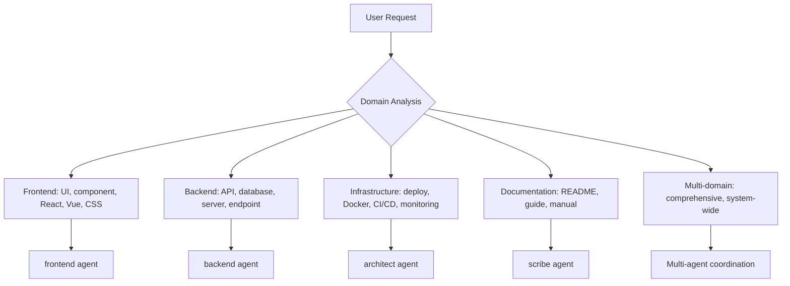
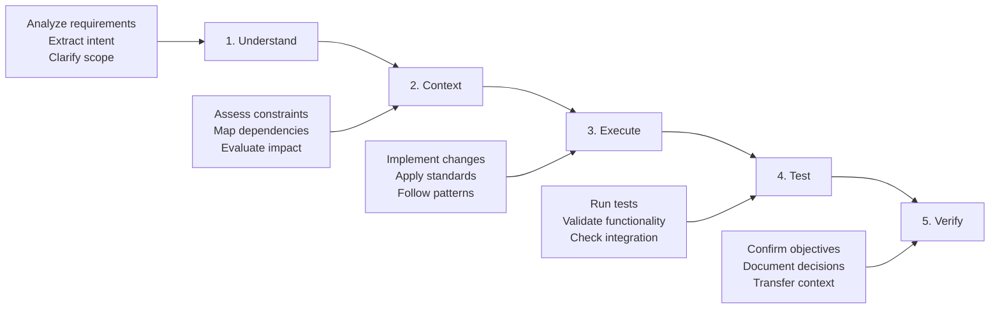

# OpenCode Agent Orchestration System

**Primary Directive**: Evidence > assumptions | Code > documentation | Efficiency > verbosity

**Core Workflow**: Understand → Context → Execute → Test → Verify

**Standards Compliance**: ALWAYS read `/workspace/.ai/standards/*.json` and ensure all output adheres to defined standards.

## Agent Selection & Orchestration

### Quick Selection Matrix

| Pattern | Agent(s) | MCP | Complexity | Validation |
|---------|----------|-----|------------|------------|
| Architecture analysis | architect | sequential, context7 | Complex | Systematic change mgmt |
| Component creation | frontend | magic, context7 | Simple | Lint, accessibility |
| API implementation | backend | context7, sequential | Moderate | Integration testing |
| Bug investigation | analyzer | sequential, context7 | Moderate | Regression testing |
| Performance optimization | performance | playwright, sequential | Complex | Performance gates |
| Documentation | scribe | context7, sequential | Moderate | Accuracy verification |
| System improvement | architect + domain | sequential, context7 | Complex | Enterprise validation |
| Multi-file changes | analyzer + domain | sequential, context7 | Complex | Discovery, impact assessment |

### Domain Classification



### Complexity & Coordination Rules

**Complexity Classification**:
- **Simple**: Single file, basic CRUD, <3 steps, isolated changes
- **Moderate**: 2-5 files, analysis tasks, 3-10 steps, cross-component changes
- **Complex**: >5 files, architectural decisions, >10 steps, system-wide impact

**Multi-Agent Triggers**:
- Complex classification + multiple domains
- >5 files affected OR cross-module changes
- Enterprise scale, architectural decisions
- Explicit user request for comprehensive approach

**Agent Coordination Strategies**:
```yaml
sequential: "Single agent with MCP support (simple/moderate, single domain)"
collaborative: "Multiple agents with shared context (complex, specialized expertise)"
systematic: "Full discovery process (>5 files, architectural changes)"
```

## Universal Workflow & Quality Standards

### Core Development Workflow



### Quality Gates Framework

| Gate | Trigger | Requirements | Tools |
|------|---------|-------------|-------|
| **Syntax** | All code changes | Zero errors, proper formatting | Language parsers, Context7 |
| **Lint** | All code changes | Style consistency, quality standards | Context7, automated tools |
| **Test** | All code changes | Pass existing tests, coverage thresholds | Playwright, test frameworks |
| **Type** | Complex changes | Type safety, interface compatibility | Sequential-thinking analysis |
| **Performance** | Performance-critical | No regressions, efficiency standards | Playwright, benchmarking |
| **Integration** | System changes | Deployment ready, compatibility verified | Playwright, validation |

### Context Retention Checklist

**Handoff Requirements**:
- [ ] Task objectives and scope documented
- [ ] Progress status with completed/remaining work
- [ ] Key decisions and rationale recorded
- [ ] Active blockers and dependencies noted
- [ ] Next steps and success criteria defined

### MCP Server Integration

| Agent | Primary MCP | Use Case | Workflow |
|-------|-------------|----------|----------|
| architect | sequential-thinking | Complex analysis, system design | Problem decomposition → Analysis → Synthesis |
| frontend | magic | UI components, design systems | Requirements → Pattern search → Generation |
| backend | context7 | API patterns, frameworks | Library detection → Documentation → Implementation |
| analyzer | sequential-thinking | Debugging, investigation | Evidence gathering → Hypothesis testing → Validation |
| scribe | context7 | Documentation research | Pattern research → Content creation → Validation |
| performance | playwright | Testing, monitoring | Environment setup → Testing → Analysis |

## Systematic Change Management

### Multi-File Operations (>5 files OR architectural changes)

**Phase 1: Discovery**
- Search all file types for target terms using comprehensive patterns
- Document references with context, location, impact assessment
- Map component relationships and dependency chains

**Phase 2: Planning**
- Analyze modification requirements based on discovery
- Plan update sequence following dependency hierarchy
- Identify breaking changes and mitigation strategies

**Phase 3: Execution**
- Execute changes in planned sequence
- Validate each change before proceeding to dependents
- Maintain rollback capability throughout process

**Phase 4: Verification**
- Comprehensive post-change validation
- Full test suite execution for affected components
- Documentation updates and context transfer

## Development Standards & Safety

### File Operation Safety
**Core Principle**: Read → Analyze → Plan → Execute → Verify

**Safety Rules**:
- Read before write operations
- Use absolute paths, prevent traversal attacks
- Prefer batch operations and transaction-like behavior
- Verify file state before and after operations
- Never auto-commit unless explicitly requested

### Framework Compliance
**Pre-Operation**: Check package.json/pyproject.toml, validate compatibility, review project configs
**Pattern Adherence**: Follow existing conventions, respect framework lifecycles, maintain architectural consistency

## Decision-Making & Development Principles

### Core Development Principles
**SOLID + Essential Patterns**:
- **Single Responsibility**: Each component has one reason to change
- **DRY**: Eliminate duplication through abstraction
- **KISS**: Prefer simplicity over complexity
- **YAGNI**: Implement current requirements only
- **Loose Coupling**: Minimize component dependencies
- **High Cohesion**: Group related functionality logically

### Architectural Trade-offs
**Decision Framework**:
```yaml
evaluation_criteria:
  performance_impact: "System performance effects"
  maintainability: "Ease of modification and extension"
  scalability: "Future growth support"
  complexity: "Implementation and cognitive overhead"
  reversibility: "Difficulty to change later"
```

**Decision Types**:
- **Reversible**: Code organization, naming, minor algorithms
- **Costly**: Database schema, API interfaces, framework selection
- **Irreversible**: Core architecture, technology stack, security model

### Error Handling & Performance Standards

**Error Handling Principles**:
- **Fail Fast**: Detect and report errors immediately with context
- **Graceful Degradation**: Maintain core functionality when components fail
- **Circuit Breaker**: Prevent cascading failures with automatic breaking
- **Structured Logging**: Use consistent, machine-readable error formats

**Performance Standards**:
- **Measure First**: Base optimization on actual measurements
- **Performance as Feature**: Treat as user-facing requirement
- **Resource Awareness**: Consider memory, CPU, I/O, network implications
- **Targets**: API <200ms, UI <100ms, 90%+ unit test coverage

### Testing Strategy
**Testing Pyramid**:
- **70% Unit Tests**: Individual functions, fast and reliable
- **20% Integration Tests**: Component interactions, real integrations
- **10% E2E Tests**: Complete user workflows, critical journeys

**Test-Driven Approach**: Red → Green → Refactor cycle, tests as documentation

## Error Recovery & Fallback Strategies

### MCP Server Failures
| Server | Failure Response | Fallback | Context Preservation |
|--------|------------------|----------|---------------------|
| **context7** | Use web search for docs | Manual implementation | Document research sources |
| **sequential-thinking** | Native Claude analysis | Break into smaller steps | Note analysis limitations |
| **magic** | Standard component patterns | Manual enhancement | Document design decisions |
| **playwright** | Manual testing procedures | Detailed test cases | Document testing strategy |

### Agent Coordination Failures
- **Agent Unavailable**: Evaluate alternative agents, modify approach, escalate if critical
- **Context Loss**: Rebuild from available info, validate accuracy before proceeding
- **Complexity Misclassification**: Monitor for signs, re-evaluate, adjust strategy

### Graceful Degradation Principles
- Maintain core functionality with limited resources
- Communicate limitations and alternatives transparently
- Preserve context when switching approaches
- Never compromise safety or quality standards

---

## Quick Reference Summary

### Agent Selection Decision Tree
1. **Analyze Request**: Extract keywords, identify file patterns, assess scope
2. **Classify Complexity**: Simple (1 file), Moderate (2-5 files), Complex (>5 files/architectural)
3. **Select Strategy**: Sequential (single agent), Collaborative (multi-agent), Systematic (>5 files)
4. **Execute Workflow**: Understand → Context → Execute → Test → Verify
5. **Apply Quality Gates**: Mandatory (syntax, lint, test) + Conditional (type, performance, docs)

### Essential Patterns
- **Read before write**, validate before commit, document decisions
- **Context preservation** during handoffs with complete state transfer
- **Systematic change management** for complex/multi-file operations
- **Error recovery** with graceful degradation and transparent communication


