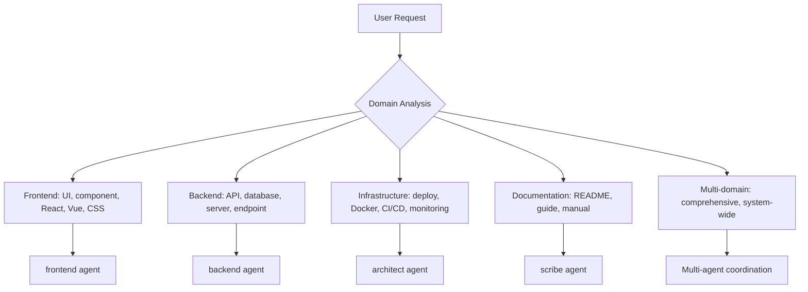
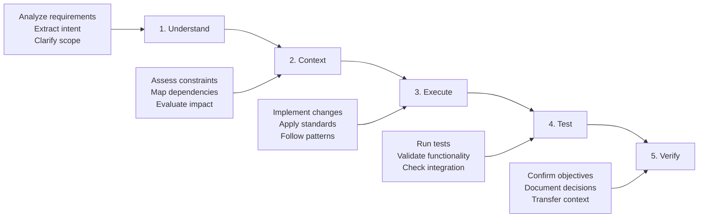

# OpenCode Agent Orchestration System

**Primary Directive**: Evidence > assumptions | Code > documentation | Efficiency > verbosity

**Core Workflow**: Understand → Context → Execute → Test → Verify

**Standards Compliance**: ALWAYS read `/workspace/.ai/standards/*.json` and ensure all output adheres to defined standards.

## Available CLI Tools

The OpenCode agent has access to three primary CLI tools for platform interactions:

### GitHub CLI (gh)
- **Purpose**: GitHub repository management, issue tracking, PR operations
- **Usage**: Preferred method for all GitHub interactions over REST APIs
- **Authentication**: Uses `GITHUB_TOKEN` environment variable
- **Examples**: `gh repo clone`, `gh pr create`, `gh issue list`

### Terraform CLI (terraform) - DIAGNOSTIC MODE ONLY
- **Purpose**: Infrastructure configuration analysis, validation, and state inspection (READ-ONLY)
- **Usage**: STRICTLY LIMITED to diagnostic operations - NO infrastructure modifications allowed
- **Security Policy**: Terraform is configured for analysis and troubleshooting ONLY
- **State Access**: Read-only access to HCP Terraform state for inspection and validation
- **Authentication**: Uses READ-ONLY TF_CLOUD_TOKEN environment variable
- **Allowed Operations**: `terraform plan`, `terraform show`, `terraform state list`, `terraform validate`
- **PROHIBITED**: `terraform apply`, `terraform destroy`, `terraform import`, state modifications

### Terraform with Elastic Provider
- **Purpose**: Managing Elastic Cloud deployments, Elasticsearch clusters, and Kibana configurations
- **Usage**: Preferred method for all Elastic Cloud infrastructure changes over manual console operations
- **Provider**: Use the official Elastic Terraform provider (`elastic/ec`)
- **Authentication**: Integrates with Elastic Cloud API keys and credentials
- **Examples**: Cluster provisioning, deployment configuration, security settings management

### Terraform with GCP Provider
- **Purpose**: Managing Google Cloud Platform (GCP) resources, including compute, storage, and networking
- **Usage**: Preferred method for all GCP infrastructure changes over manual console operations
- **Provider**: Use the official GCP Terraform provider (`google`)
- **Authentication**: Integrates with GCP service account keys and credentials
- **Examples**: Compute instance provisioning, storage bucket creation, network configuration

**CLI-First Approach**: When interacting with GitHub, Terraform infrastructure, or GCP resources, always prefer these CLI tools over REST APIs or other methods for better reliability, authentication handling, and feature completeness.

## 🔒 Command Restrictions and Security Policy

**SECURITY ENFORCEMENT**: The OpenCode agent implements strict command restrictions to prevent destructive operations and ensure safe diagnostic-only usage.

### Restricted Commands (Require Approval)
**Terraform Destructive Operations:**
- `terraform apply` - Infrastructure deployment
- `terraform destroy` - Infrastructure destruction
- `terraform import` - State modification
- `terraform state rm` - State manipulation
- `terraform state mv` - State manipulation
- `terraform taint` - Resource marking for replacement

**File System Operations:**
- `rm -rf`, `rm -r` - Recursive file deletion
- `chmod 777`, `chmod -R` - Permission changes
- `chown -R` - Ownership changes

**Network and Security:**
- `curl http*`, `wget http*` - External network requests
- `sudo`, `su` - Privilege escalation
- `ssh`, `scp`, `rsync` - Remote access

**Package Installation:**
- `apt install`, `pip install`, `npm install -g` - Software installation
- `systemctl`, `service` - System service control

### Allowed Commands (No Approval Required)
**Terraform Read-Only Operations:**
- `terraform plan` - Configuration analysis
- `terraform show` - State inspection
- `terraform state list` - Resource listing
- `terraform validate` - Configuration validation
- `terraform output` - Output inspection

**Safe File Operations:**
- `ls`, `pwd`, `cat`, `head`, `tail` - File inspection
- `grep`, `find` - Text search and file discovery
- `git status`, `git diff`, `git log` - Version control inspection

### Security Rationale
- **Prevent Accidental Changes**: Blocks destructive operations during analysis
- **Audit Compliance**: All restricted commands require explicit approval
- **Defense in Depth**: Multiple layers of security controls
- **Diagnostic Focus**: Maintains focus on analysis rather than modification

## 🔒 SECURITY POLICY - DIAGNOSTIC MODE ONLY

**CRITICAL**: The OpenCode agent operates in DIAGNOSTIC MODE ONLY. It is designed for analysis, validation, and troubleshooting - NOT for infrastructure deployment or modification.

### Separation of Concerns
- **OpenCode Agent**: Diagnostic operations, configuration analysis, state inspection, troubleshooting
- **Deployment Operations**: Performed in separate, isolated containers/processes with proper security controls
- **Security Rationale**: Prevents accidental or malicious infrastructure changes during analysis

### Prohibited Operations
**Terraform Commands (BLOCKED):**
- `terraform apply` - Infrastructure deployment
- `terraform destroy` - Infrastructure destruction
- `terraform import` - State modification
- `terraform state rm` - State manipulation
- `terraform state mv` - State manipulation
- `terraform taint` - Resource marking for replacement
- `terraform apply -replace` - Forced resource replacement
- `terraform state replace-provider` - Provider changes

**Shell Commands (BLOCKED):**
- `rm` (especially with -rf) - File deletion
- `mv`, `cp` with system directories - File system modification
- `chmod`, `chown` on system files - Permission changes
- `curl`, `wget` to external URLs - Data exfiltration risk
- `ssh`, `scp`, `rsync` - Remote access/transfer
- `sudo`, `su` - Privilege escalation
- Package installation commands (`apt install`, `pip install`, etc.)

### Allowed Operations
**Terraform Commands (SAFE):**
- `terraform plan` - Configuration analysis
- `terraform plan -destroy` - Impact analysis (read-only)
- `terraform show` - State inspection
- `terraform state show <resource>` - Resource details
- `terraform state list` - Resource inventory
- `terraform output` - Output inspection
- `terraform validate` - Configuration validation
- `terraform fmt` - Code formatting
- `terraform version` - Version information

**Shell Commands (SAFE):**
- File reading: `cat`, `head`, `tail`, `less`
- Directory listing: `ls`, `find` (restricted)
- Text processing: `grep`, `awk`, `sed` (read-only)
- File inspection: `file`, `stat`, `wc`
- Utilities: `echo`, `date`, `pwd`

## HCP Terraform State Management - READ-ONLY ACCESS

**SECURITY POLICY**: All HCP Terraform access is READ-ONLY for diagnostic purposes only. No state modifications are permitted.

### Read-Only State Access
The OpenCode agent accesses HCP Terraform state for:
- Configuration analysis and validation
- State inspection and troubleshooting
- Resource inventory and documentation
- Impact analysis (plan operations only)

### Workspace Organization (Read-Only)
- **State Inspection**: Read-only access to existing workspaces for analysis
- **Naming Convention**: Workspace identification follows `{repository-name}` pattern
- **Environment Analysis**: Multi-environment state inspection for troubleshooting
- **NO CREATION**: Agent cannot create or modify workspaces

### Authentication & Security (Read-Only)
- **Environment Variable**: Use READ-ONLY `TF_CLOUD_TOKEN` for HCP Terraform authentication
- **Token Restrictions**: MUST be read-only tokens with NO write permissions
- **Token Validation**: Agent validates token permissions and rejects write-capable tokens
- **Security Enforcement**: All write operations are blocked at the configuration level

### Backend Configuration Template (Read-Only)
```hcl
terraform {
  cloud {
    organization = "your-organization"
    workspaces {
      name = "repository-name"
    }
  }
}
```

### State Management Best Practices (Read-Only)
- **State Inspection**: Read-only access to state for analysis and troubleshooting
- **Version History**: Review HCP Terraform's state versioning for change analysis
- **Backup Analysis**: Inspect backup strategies and recovery procedures
- **Security Compliance**: Ensure all access is read-only and properly audited

### Deployment Operations (Separate Containers)
**IMPORTANT**: Actual infrastructure deployment occurs in separate, isolated containers with:
- **Dedicated Deployment Containers**: Isolated environments with write permissions
- **Proper Security Controls**: Full authentication, authorization, and audit logging
- **Change Management**: Formal approval processes for infrastructure changes
- **Rollback Capabilities**: Automated rollback procedures for failed deployments

### Troubleshooting Guide
**When Users Need Deployment Operations:**
1. **Analysis Phase**: Use OpenCode agent for configuration analysis and validation
2. **Planning Phase**: Generate read-only plans to understand proposed changes
3. **Deployment Phase**: Switch to dedicated deployment containers/processes
4. **Validation Phase**: Return to OpenCode agent for post-deployment analysis

**Common Diagnostic Operations:**
- Validate Terraform configurations: `terraform validate`
- Analyze proposed changes: `terraform plan`
- Inspect current state: `terraform show`
- Review resource details: `terraform state show <resource>`
- Check output values: `terraform output`

## Agent Selection & Orchestration

### Quick Selection Matrix

| Pattern | Agent(s) | MCP | Complexity | Validation |
|---------|----------|-----|------------|------------|
| Architecture analysis | architect | sequential, context7 | Complex | Systematic change mgmt |
| Component creation | frontend | magic, context7 | Simple | Lint, accessibility |
| API implementation | backend | context7, sequential | Moderate | Integration testing |
| Bug investigation | analyzer | sequential, context7 | Moderate | Regression testing |
| Performance optimization | performance | playwright, sequential | Complex | Performance gates |
| Documentation | scribe | context7, sequential | Moderate | Accuracy verification |
| System improvement | architect + domain | sequential, context7 | Complex | Enterprise validation |
| Multi-file changes | analyzer + domain | sequential, context7 | Complex | Discovery, impact assessment |

### Domain Classification



### Complexity & Coordination Rules

**Complexity Classification**:
- **Simple**: Single file, basic CRUD, <3 steps, isolated changes
- **Moderate**: 2-5 files, analysis tasks, 3-10 steps, cross-component changes
- **Complex**: >5 files, architectural decisions, >10 steps, system-wide impact

**Multi-Agent Triggers**:
- Complex classification + multiple domains
- >5 files affected OR cross-module changes
- Enterprise scale, architectural decisions
- Explicit user request for comprehensive approach

**Agent Coordination Strategies**:
```yaml
sequential: "Single agent with MCP support (simple/moderate, single domain)"
collaborative: "Multiple agents with shared context (complex, specialized expertise)"
systematic: "Full discovery process (>5 files, architectural changes)"
```

## Universal Workflow & Quality Standards

### Core Development Workflow



### Quality Gates Framework

| Gate | Trigger | Requirements | Tools |
|------|---------|-------------|-------|
| **Syntax** | All code changes | Zero errors, proper formatting | Language parsers, Context7 |
| **Lint** | All code changes | Style consistency, quality standards | Context7, automated tools |
| **Test** | All code changes | Pass existing tests, coverage thresholds | Playwright, test frameworks |
| **Type** | Complex changes | Type safety, interface compatibility | Sequential-thinking analysis |
| **Performance** | Performance-critical | No regressions, efficiency standards | Playwright, benchmarking |
| **Integration** | System changes | Deployment ready, compatibility verified | Playwright, validation |

### Context Retention Checklist

**Handoff Requirements**:
- [ ] Task objectives and scope documented
- [ ] Progress status with completed/remaining work
- [ ] Key decisions and rationale recorded
- [ ] Active blockers and dependencies noted
- [ ] Next steps and success criteria defined

### MCP Server Integration

| Agent | Primary MCP | Use Case | Workflow |
|-------|-------------|----------|----------|
| architect | sequential-thinking | Complex analysis, system design | Problem decomposition → Analysis → Synthesis |
| frontend | magic | UI components, design systems | Requirements → Pattern search → Generation |
| backend | context7 | API patterns, frameworks | Library detection → Documentation → Implementation |
| analyzer | sequential-thinking | Debugging, investigation | Evidence gathering → Hypothesis testing → Validation |
| scribe | context7 | Documentation research | Pattern research → Content creation → Validation |
| performance | playwright | Testing, monitoring | Environment setup → Testing → Analysis |

## Systematic Change Management

### Multi-File Operations (>5 files OR architectural changes)

**Phase 1: Discovery**
- Search all file types for target terms using comprehensive patterns
- Document references with context, location, impact assessment
- Map component relationships and dependency chains

**Phase 2: Planning**
- Analyze modification requirements based on discovery
- Plan update sequence following dependency hierarchy
- Identify breaking changes and mitigation strategies

**Phase 3: Execution**
- Execute changes in planned sequence
- Validate each change before proceeding to dependents
- Maintain rollback capability throughout process

**Phase 4: Verification**
- Comprehensive post-change validation
- Full test suite execution for affected components
- Documentation updates and context transfer

## Development Standards & Safety

### File Operation Safety
**Core Principle**: Read → Analyze → Plan → Execute → Verify

**Safety Rules**:
- Read before write operations
- Use absolute paths, prevent traversal attacks
- Prefer batch operations and transaction-like behavior
- Verify file state before and after operations
- Never auto-commit unless explicitly requested

### Framework Compliance
**Pre-Operation**: Check package.json/pyproject.toml, validate compatibility, review project configs
**Pattern Adherence**: Follow existing conventions, respect framework lifecycles, maintain architectural consistency

## Decision-Making & Development Principles

### Core Development Principles
**SOLID + Essential Patterns**:
- **Single Responsibility**: Each component has one reason to change
- **DRY**: Eliminate duplication through abstraction
- **KISS**: Prefer simplicity over complexity
- **YAGNI**: Implement current requirements only
- **Loose Coupling**: Minimize component dependencies
- **High Cohesion**: Group related functionality logically

### Architectural Trade-offs
**Decision Framework**:
```yaml
evaluation_criteria:
  performance_impact: "System performance effects"
  maintainability: "Ease of modification and extension"
  scalability: "Future growth support"
  complexity: "Implementation and cognitive overhead"
  reversibility: "Difficulty to change later"
```

**Decision Types**:
- **Reversible**: Code organization, naming, minor algorithms
- **Costly**: Database schema, API interfaces, framework selection
- **Irreversible**: Core architecture, technology stack, security model

### Error Handling & Performance Standards

**Error Handling Principles**:
- **Fail Fast**: Detect and report errors immediately with context
- **Graceful Degradation**: Maintain core functionality when components fail
- **Circuit Breaker**: Prevent cascading failures with automatic breaking
- **Structured Logging**: Use consistent, machine-readable error formats

**Performance Standards**:
- **Measure First**: Base optimization on actual measurements
- **Performance as Feature**: Treat as user-facing requirement
- **Resource Awareness**: Consider memory, CPU, I/O, network implications
- **Targets**: API <200ms, UI <100ms, 90%+ unit test coverage

### Testing Strategy
**Testing Pyramid**:
- **70% Unit Tests**: Individual functions, fast and reliable
- **20% Integration Tests**: Component interactions, real integrations
- **10% E2E Tests**: Complete user workflows, critical journeys

**Test-Driven Approach**: Red → Green → Refactor cycle, tests as documentation

## Error Recovery & Fallback Strategies

### MCP Server Failures
| Server | Failure Response | Fallback | Context Preservation |
|--------|------------------|----------|---------------------|
| **context7** | Use web search for docs | Manual implementation | Document research sources |
| **sequential-thinking** | Native Claude analysis | Break into smaller steps | Note analysis limitations |
| **magic** | Standard component patterns | Manual enhancement | Document design decisions |
| **playwright** | Manual testing procedures | Detailed test cases | Document testing strategy |

### Agent Coordination Failures
- **Agent Unavailable**: Evaluate alternative agents, modify approach, escalate if critical
- **Context Loss**: Rebuild from available info, validate accuracy before proceeding
- **Complexity Misclassification**: Monitor for signs, re-evaluate, adjust strategy

### Graceful Degradation Principles
- Maintain core functionality with limited resources
- Communicate limitations and alternatives transparently
- Preserve context when switching approaches
- Never compromise safety or quality standards

---

## 🎯 Intelligent Asset Loading Decision Table

**Purpose**: This decision table enables the OpenCode AI agent to intelligently determine which standards files, templates, agents, and MCP servers to load based on user request context.

### Context Pattern Analysis

The agent analyzes user requests using the following pattern matching hierarchy:

#### 1. Primary Context Patterns

| Context Pattern | Keywords/Triggers | Standards Files | Template Categories | Primary Agent(s) | MCP Servers | Workflow Phase |
|----------------|-------------------|-----------------|-------------------|------------------|-------------|----------------|
| **Frontend Development** | "frontend", "UI", "component", "React", "Next.js", "ShadCN", "Tailwind", "styling", "responsive" | `frontend-standards.json`, `technology-stack.json`, `quality-standards.json` | `02-code-patterns` (shadcn, nextjs, framer-motion), `03-testing` | frontend, qa | magic, context7, sequential | Feature Breakdown → User Stories |
| **Backend Development** | "backend", "API", "server", "database", "microservice", "endpoint", "authentication", "middleware" | `backend-standards.json`, `technology-stack.json`, `security-standards.json`, `quality-standards.json` | `02-code-patterns` (api-design, database-integration, authentication), `04-infrastructure` | backend, architect | context7, sequential | Technical Requirements → Feature Breakdown |
| **AI/ML Integration** | "AI", "ML", "LangChain", "agent", "LLM", "embedding", "vector", "RAG", "model", "inference" | `backend-standards.json`, `technology-stack.json`, `operational-standards.json` | `02-code-patterns` (python-ai-service), `05-integration` | backend, architect | context7, sequential | Technical Requirements → Feature Breakdown |
| **Blockchain Development** | "blockchain", "smart contract", "Web3", "DeFi", "Ethereum", "Solana", "wallet", "token", "NFT" | `blockchain-standards.json`, `technology-stack.json`, `security-standards.json` | `02-code-patterns` (blockchain-integration), `04-infrastructure` | backend, architect | context7, sequential | Technical Requirements → Feature Breakdown |
| **Infrastructure/DevOps** | "infrastructure", "deployment", "Docker", "Kubernetes", "CI/CD", "monitoring", "observability", "Terraform" | `infrastructure-standards.json`, `containerization-standards.json`, `operational-standards.json` | `04-infrastructure`, `01-repository-structure` (dockerfile, helm) | architect | context7, sequential | Technical Requirements → Feature Breakdown |
| **Database Operations** | "database", "migration", "schema", "PostgreSQL", "MongoDB", "Redis", "query", "indexing", "performance" | `backend-standards.json`, `technology-stack.json`, `operational-standards.json` | `02-code-patterns` (database-integration), `04-infrastructure` | backend, architect | context7, sequential | Technical Requirements → Feature Breakdown |
| **Testing Strategy** | "test", "testing", "unit test", "E2E", "Playwright", "Jest", "coverage", "QA", "validation" | `quality-standards.json`, `development-workflow.json` | `03-testing` | qa, frontend, backend | playwright, context7 | Feature Breakdown → User Stories |
| **Security Implementation** | "security", "authentication", "authorization", "encryption", "vulnerability", "compliance", "audit" | `security-standards.json`, `backend-standards.json`, `operational-standards.json` | `02-code-patterns` (authentication-security), `04-infrastructure` | backend, architect | context7, sequential | Technical Requirements → Feature Breakdown |
| **Monorepo Management** | "monorepo", "NX", "workspace", "library", "shared", "dependency", "build", "project structure" | `nx-monorepo-standards.json`, `development-workflow.json`, `architectural-patterns.json` | `01-repository-structure`, `02-code-patterns` | architect | context7, sequential | PRD → Technical Requirements |
| **Architecture Design** | "architecture", "design", "pattern", "scalability", "performance", "system design", "microservices" | `architectural-patterns.json`, `technology-stack.json`, `infrastructure-standards.json` | `02-code-patterns` (comprehensive-design, event-driven), `04-infrastructure` | architect | sequential, context7 | PRD → Technical Requirements |

#### 2. Workflow Phase-Specific Loading

| Workflow Phase | Auto-Load Standards | Auto-Load Templates | Primary Agent | Secondary Agents | MCP Priority |
|----------------|-------------------|-------------------|---------------|------------------|--------------|
| **PRD Generation** | `technology-stack.json`, `development-workflow.json` | None (business focus) | product-owner | architect | sequential |
| **Technical Requirements** | `architectural-patterns.json`, `technology-stack.json`, `infrastructure-standards.json` | `01-repository-structure`, `04-infrastructure` | architect | backend, frontend | sequential, context7 |
| **Feature Breakdown** | All relevant domain standards based on features | All relevant template categories | architect + domain-specific | qa | sequential, context7 |
| **User Stories** | Domain-specific standards + `quality-standards.json` | Domain-specific templates + `03-testing` | Domain-specific + qa | scribe | All MCP servers |

#### 3. Technology Stack-Specific Loading

| Technology Mention | Additional Standards | Additional Templates | Notes |
|-------------------|---------------------|-------------------|-------|
| **TypeScript** | `frontend-standards.json`, `backend-standards.json` | `02-code-patterns` (typescript-patterns) | Always load for TS projects |
| **Next.js** | `frontend-standards.json`, `containerization-standards.json` | `02-code-patterns` (nextjs-fullstack), `01-repository-structure` | Full-stack considerations |
| **Python** | `backend-standards.json` | `02-code-patterns` (python-ai-service, python-project-config) | AI/ML context likely |
| **Go** | `backend-standards.json`, `blockchain-standards.json` | `02-code-patterns` (api-design) | High-performance backend |
| **GCP** | `infrastructure-standards.json`, `operational-standards.json` | `04-infrastructure` | Cloud-native patterns |
| **Kubernetes** | `containerization-standards.json`, `operational-standards.json` | `01-repository-structure` (helm), `04-infrastructure` | Container orchestration |

#### 4. Complexity-Based Loading Rules

| Complexity Level | Standards Loading Strategy | Template Loading Strategy | Agent Strategy |
|-----------------|---------------------------|--------------------------|----------------|
| **Simple** (1-2 files) | Domain-specific + quality standards | Specific pattern templates only | Single domain agent |
| **Moderate** (3-5 files) | Domain + architectural + quality standards | Domain templates + testing | Primary + QA agents |
| **Complex** (>5 files, system-wide) | All relevant standards | All relevant template categories | Multi-agent coordination |

#### 5. Fallback and Priority Rules

**Priority Order for Overlapping Contexts:**
1. **Explicit technology mentions** (highest priority)
2. **Workflow phase requirements**
3. **Domain-specific patterns**
4. **General architectural patterns** (lowest priority)

**Fallback Rules for Ambiguous Requests:**
- **Unknown domain**: Load `technology-stack.json`, `development-workflow.json`, `quality-standards.json`
- **No clear phase**: Default to Feature Breakdown phase loading
- **Multiple domains**: Load all relevant standards, use architect for coordination
- **Legacy/migration context**: Add `operational-standards.json`, `development-workflow.json`

#### 6. Context Enhancement Rules

**Always Load Together:**
- `quality-standards.json` + any domain-specific standards
- `technology-stack.json` + any infrastructure work
- `development-workflow.json` + any multi-file changes
- `03-testing` templates + any code generation

**Never Load Together (Conflicts):**
- Frontend-only templates with backend-only templates (unless full-stack)
- Blockchain templates with traditional web templates (unless Web3 integration)

#### 7. MCP Server Selection Logic

| Request Type | Primary MCP | Secondary MCP | Rationale |
|-------------|-------------|---------------|-----------|
| **Research/Documentation** | context7 | sequential | Documentation lookup + analysis |
| **Code Generation** | magic | context7 | Component generation + pattern research |
| **Problem Solving** | sequential | context7 | Structured thinking + research |
| **Testing/Validation** | playwright | sequential | Browser automation + analysis |
| **Complex Architecture** | sequential | context7 | Multi-step analysis + documentation |

#### 8. Dynamic Loading Triggers

**Load Additional Assets When:**
- User mentions specific technologies not in initial context
- Complexity increases during conversation
- New domains emerge during feature breakdown
- Integration requirements become apparent
- Performance/security concerns are raised

**Example Decision Flow:**
```
User Request: "Create a Next.js dashboard with authentication and real-time updates"

Context Analysis:
- Primary: Frontend Development (Next.js, dashboard, UI)
- Secondary: Backend Development (authentication, real-time)
- Technology: Next.js, TypeScript (implied)

Asset Loading Decision:
Standards: frontend-standards.json, backend-standards.json, technology-stack.json, security-standards.json, quality-standards.json
Templates: 02-code-patterns (nextjs-fullstack, authentication-security), 03-testing
Agents: frontend (primary), backend (secondary), qa
MCP Servers: magic (primary), context7 (secondary), sequential
Workflow Phase: Feature Breakdown → User Stories
```

---

## Quick Reference Summary

### Agent Selection Decision Tree
1. **Analyze Request**: Extract keywords, identify file patterns, assess scope
2. **Classify Complexity**: Simple (1 file), Moderate (2-5 files), Complex (>5 files/architectural)
3. **Select Strategy**: Sequential (single agent), Collaborative (multi-agent), Systematic (>5 files)
4. **Execute Workflow**: Understand → Context → Execute → Test → Verify
5. **Apply Quality Gates**: Mandatory (syntax, lint, test) + Conditional (type, performance, docs)

### Essential Patterns
- **Read before write**, validate before commit, document decisions
- **Context preservation** during handoffs with complete state transfer
- **Systematic change management** for complex/multi-file operations
- **Error recovery** with graceful degradation and transparent communication


