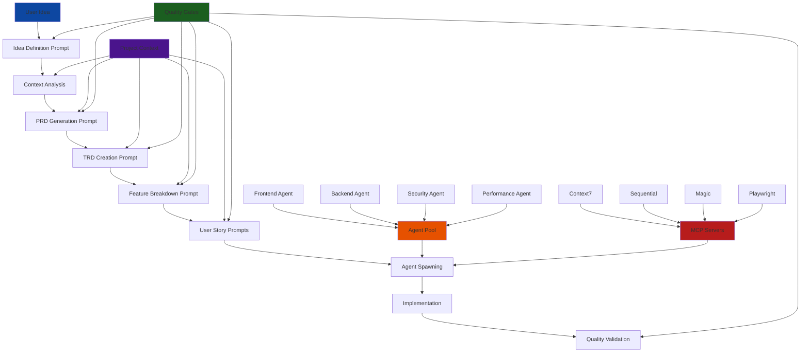
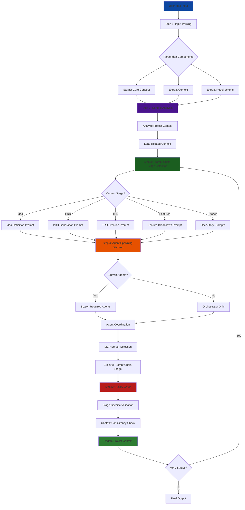
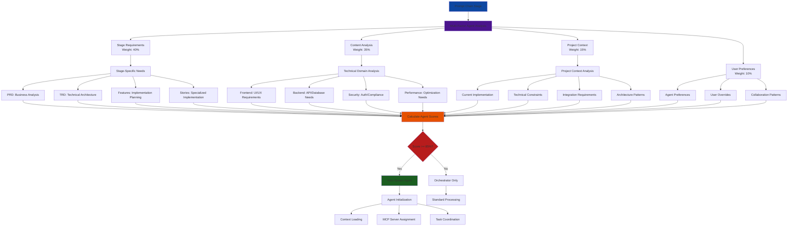
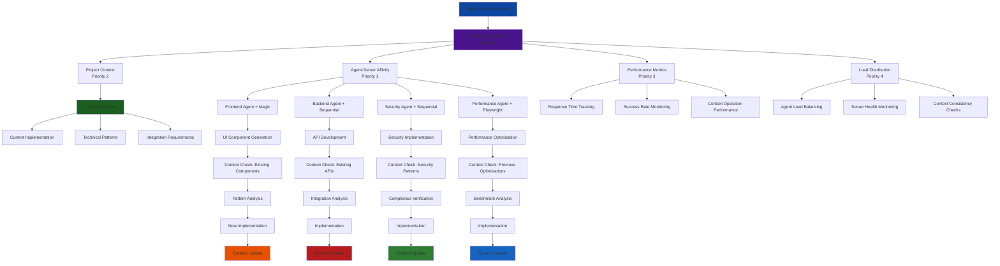
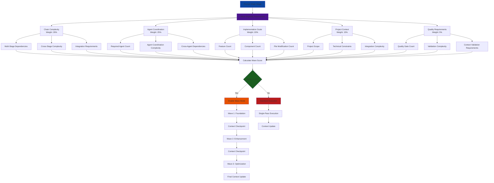
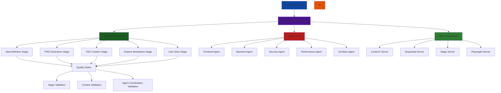
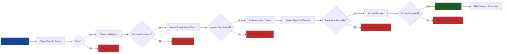

# Architecture Diagrams - SuperClaude Framework Prompt Chain Architecture

## 1. Prompt Chain Architecture Overview

## 2. Prompt Chain Processing Flow with Context Integration

## 3. Agent Spawning and Context-Aware Scoring System

## 4. Agent-MCP Server Coordination with Context Integration

## 5. Prompt Chain Wave System with Context Integration

## 7. OpenCode CLI Prompt Chain Implementation Architecture

## 8. Quality Gates Integration with Prompt Chain

---

*These diagrams provide visual representations of the SuperClaude Framework prompt chain architecture with context-aware processing and agent coordination. Each diagram illustrates key relationships and processes for the OpenCode CLI implementation.*
